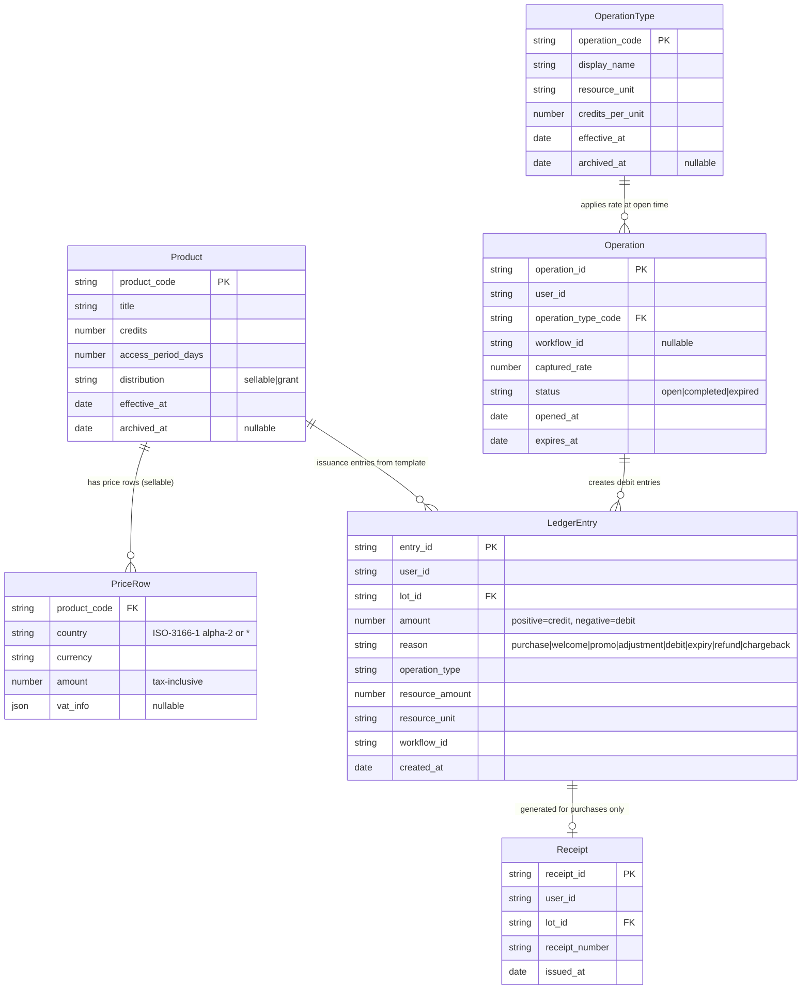
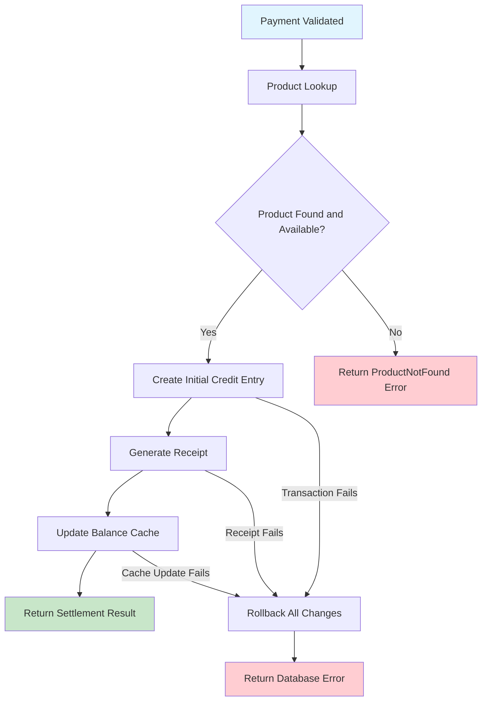
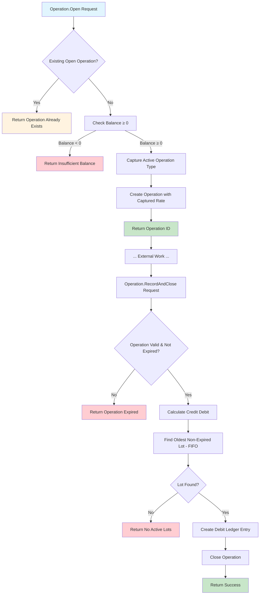
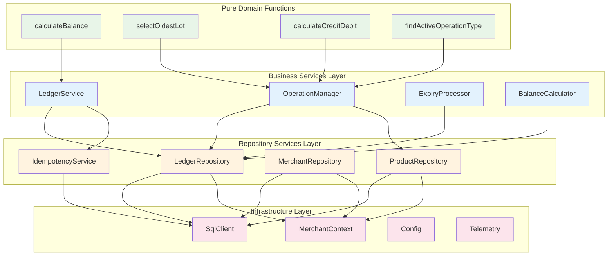

# 1. Business Domain Architecture

## Purpose

This document defines the business domain architecture for the Credit Management Service, providing business-focused specifications for domain entities, business processes, and service composition patterns. The architecture follows Domain-Driven Design principles with clear separation between business logic and implementation concerns.

## 1.1 Domain Model Composition

### Core Entities

The domain model consists of entities that represent stable business concepts with clear boundaries and responsibilities.

#### User Identity (Reference Only)
```
Reference: User (not persisted as entity)
  Identifier: user_id
```

**Business Rules:**
- User identity managed entirely by upstream application
- Credit system references user_id but does not persist user data
- user_id is opaque string - credit system has no user profile, preferences, or metadata

#### Merchant Configuration (Application Config)
```
Configuration: MerchantConfig (not database entity)
  Identity: merchant_id (unique identifier for operational reference)
  Database: database_connection_string (database routing)
  Legal: legal_name, registered_address, country
  Tax: tax_regime ("turnover" | "vat" | "none"), vat_rate?, tax_status_note
  Operations: receipt_series_prefix, operation_timeout_minutes, retention_years
```

**Business Rules:**
- Each merchant = separate database (complete data isolation)
- merchant_id used for: telemetry, logging, database routing, external API context
- Configuration stored as application config (not a database entity) in 1:1 app↔merchant deployments; receipt creation snapshots all merchant fields for documents; receipt numbering uses a per‑merchant DB sequence; operation timeouts are captured on Operation.Open
- Configuration stable after deployment (rare updates only)

#### Product Entity (Lot Template)
```
Entity: Product
  Identifier: product_code (unique within database)
  Core: title, credits, access_period_days
  Distribution: distribution ("sellable" | "grant")
  Grants: grant_policy? ("apply_on_signup" | "manual_grant")
  Lifecycle: effective_at, archived_at?
  Pricing: price_rows? (array of country-specific pricing)

Value Object: PriceRow
  Location: country (ISO-3166-1 alpha-2 or "*" for fallback)
  Cost: currency, amount (tax-inclusive)
  Tax: vat_info? (rate, amount, note)
```

**Business Rules:**
- Products are immutable once created (except archived_at field)
- Price changes require new product with lifecycle management
- Grant products have no prices and cannot be sold
- Only one grant policy per grant product

#### Lot (Conceptual — Initial Credit Ledger Entry)
```
Concept: Lot (alias for the initial credit ledger entry)
  Identity: lot_id = entry_id of the initial credit LedgerEntry
  Owner: user_id (credit owner reference)
  Template: product_code (template used for issuance)
  Value: credits_total = initial credit amount (entry.amount > 0)
  Lifecycle: issued_at = entry.created_at; expires_at = issued_at + access_period_days
  Origin: reason = "purchase" | "welcome" | "promo" | "adjustment"

Persistence: No separate Lot table is persisted. The ledger is the source of truth; "lot" is a role played by the initial credit entry. A materialized lot summary may exist as a read model for performance, but is rebuildable and non-authoritative.
```

**Business Rules:**
- Lot balance = sum of all LedgerEntries where entry.lot_id = lot_id (the initial entry_id)
- Individual lots can have negative balances from FIFO consumption (overdraft allowed)

#### Ledger Entry Entity (Credit/Debit Movement Record)
```
Entity: LedgerEntry (immutable movement record)
  Identifier: entry_id (unique within database)
  Owner: user_id (movement owner reference)
  Target: lot_id (the issuance entry_id this movement affects)
  Movement: amount (positive = credit, negative = debit), reason
  Operation: operation_type, resource_amount, resource_unit, workflow_id
  Issuance Context?: product_code?, expires_at? (set on issuance entries only)
  Audit: created_at (movement timestamp), created_month (UTC month for partitioning)
```

**Business Rules:**
- LedgerEntries are immutable movement records (credits and debits)
- The initial credit LedgerEntry plays the "lot" role; subsequent debits reference its entry_id via lot_id
- Operations create debit LedgerEntries targeting specific lots via FIFO algorithm
- Every LedgerEntry must reference a lot_id (where the movement is applied)
 - Partitioning: created_month = date_trunc('month', created_at at UTC) is computed on write and used as the partition key
 - Self-reference uses composite identity: debits carry lot_month and reference (lot_id, lot_month)

#### Operation Entity (Open-Operation Guard)
```
Entity: Operation (operation reservation and rate capture)
  Identifier: operation_id (unique within system)
  Context: user_id (data ownership)
  Type: operation_type_code (references active operation type)
  Workflow: workflow_id? (optional external process correlation)
  Billing: captured_rate (rate stability from Operation.Open time)
  Status: status ("open" | "completed" | "expired")
  Lifecycle: opened_at, expires_at (opened_at + merchant.operation_timeout_minutes), closed_at?
```

**Business Rules:**
- Two-phase protocol: Operation.Open (reservation) → Operation.RecordAndClose (consumption)
- Single open operation per (merchant, user_id) is enforced by a partial unique index on the unpartitioned operations table: UNIQUE(user_id) WHERE status='open'
- Rate captured during Open time ensures billing stability
- Operations expire after merchant-configured timeout period
- Actual consumption data (resource_amount, resource_unit) stored in resulting LedgerEntry
 - Closed operations are retained for a short TTL window for metrics and then cleaned up by ops jobs

#### Receipt Entity
```
Entity: Receipt (immutable purchase documentation)
  Identifier: receipt_id (unique within system)
  Context: user_id, lot_id, lot_created_month (links to credit lot composite identity)
  Numbering: receipt_number (merchant-scoped sequence: "R-AM-2025-0001")
  Issued: issued_at (receipt generation timestamp)
  Purchase: purchase_snapshot (immutable transaction details)
  Merchant: merchant_config_snapshot (legal/tax config at purchase time)

Value Object: PurchaseSnapshot
  Product: product_code, product_title
  Payment: external_ref, country, currency, amount
  Tax: tax_breakdown? (type, rate?, amount?, note?)
```

**Business Rules:**
- Exactly one receipt per purchase ledger entry
- Receipt contains snapshot data for consistent PDF generation
- Receipt numbers follow merchant prefix pattern: "R-AM-2025-0001"
- No receipts generated for grants, adjustments, or administrative actions
- Receipt numbering sequences scoped within single merchant database


#### Operation Type Entity
```
Entity: OperationType (conversion rate management)
  Identifier: operation_code (unique within merchant context)
  Display: display_name (user-friendly operation name)
  Conversion: resource_unit, credits_per_unit (rate definition)
  Lifecycle: effective_at, archived_at? (sequential version management)
```

**Business Rules:**
- Sequential lifecycle: new versions automatically archive previous versions
- Rate stability: operations capture rate at Operation.Open time
- Immutable once effective: no changes to active operation types

#### Command‑to‑Reason Mapping

- Purchase.Settled → reason = purchase
- Operation.RecordAndClose → reason = debit
- Grant.Apply (welcome/promo) → reason = welcome | promo
- CreditAdjustment.Apply → reason = adjustment
- Refund.Apply → reason = refund
- Chargeback.Apply → reason = chargeback
- Lot.Expire → reason = expiry

### Domain Services

Domain services coordinate entity interactions and enforce business rules that span multiple entities.

#### LedgerService
```
Service: LedgerService (lot and ledger entry management)
  Operations:
    createCreditLot(user_id, product, operation_context) -> Lot
    recordDebit(user_id, operation, target_lot_id) -> LedgerEntry
    calculateBalance(user_id) -> Credits
    getLedgerHistory(user_id, options?) -> LedgerEntry[]

  Business Rules:
    - Creates both Lot (container) and initial LedgerEntry (credit movement)
    - Debit LedgerEntries target specific lots via FIFO selection
    - User balance = sum of all user's LedgerEntry amounts
    - Lot balance = sum of LedgerEntries where entry.lot_id = lot.lot_id
    - All operations respect merchant data isolation at the database level
```

#### BalanceCalculator
```
Service: BalanceCalculator (pure balance computation algorithms)
  Operations:
    calculateUserBalance(ledger_entries) -> Credits
    calculateLotBalance(lot_id, ledger_entries) -> Credits
    selectOldestNonExpiredLot(lots, current_time) -> Lot?

  Algorithms:
    User Balance: sum(all ledger entries for user)
    Lot Balance: sum(ledger entries targeting specific lot_id)
    FIFO Selection: oldest non-expired lot by issued_at timestamp with positive balance
```

#### OperationManager
```
Service: OperationManager (two-phase operation lifecycle)
  Operations:
    openOperation(user_id, operation_type_code, workflow_id?) -> Operation
    recordAndCloseOperation(operation_id, resource_amount, resource_unit, completed_at) -> LedgerEntry
    cleanupExpiredOperations() -> void

  Business Rules:
    - Single open operation per (merchant, user_id) at any time. In a per‑merchant DB deployment, this is enforced within each isolated merchant database.
    - Rate captured at open time ensures billing stability
    - Operations expire after merchant-configured timeout
    - Operation entity contains only reservation data (immutable after creation)
    - Consumption data (resource_amount, resource_unit) provided at close time
    - Completed operations generate debit entries via FIFO lot selection
```

#### ExpiryProcessor
```
Service: ExpiryProcessor (automated lot expiry management)
  Operations:
    processExpiredLots(current_time) -> LedgerEntry[]
    findExpiredLots(current_time) -> Lot[]

  Business Rules:
    - Lots (issuance entries) expire when current_time > expires_at (stored on issuance entry)
    - Expired lots with positive balance generate expiry debit entries. Expiry debit entries use operation_type=lot_expiry, resource_amount=remaining_credits, resource_unit=CREDIT, workflow_id=system-generated.
    - Expiry processing runs as scheduled background jobs
    - Process lots of a single merchant in the isolated merchant database
```

### Repository Interface Contracts

Repositories provide data access interfaces for domain entities with clear contracts for business operations.

#### LedgerRepository
```
Repository: LedgerRepository (immutable ledger entry management)
  Operations:
    createLedgerEntry(entry) -> void  // entry includes created_month (UTC)
    getLedgerHistory(user_id, options?) -> LedgerEntry[]  // server derives month pruning from time range
    getUserBalance(user_id) -> Credits
    getActiveLots(user_id) -> Lot[]  // aggregated view over issuance entries (initial credit entries)

  Data Guarantees:
    - All ledger entries immutable after creation
    - Merchant data isolation enforced at query level
    - Balance calculations consistent with ledger history
```

#### ProductRepository
```
Repository: ProductRepository (product catalog management)
  Operations:
    createProduct(product) -> void
    getActiveProducts(distribution?) -> Product[]
    getProductByCode(product_code) -> Product?
    getResolvedPrice(product_code, country) -> PriceRow?  // selection order: country, then fallback "*"
    archiveProduct(product_code, archived_at) -> void

  Data Guarantees:
    - Products immutable once created (except archived_at)
    - Only active products returned unless explicitly requested
    - Merchant isolation enforced for all catalog operations
```

#### MerchantRepository
```
Repository: MerchantRepository (merchant configuration management)
  Operations:
    getMerchantConfig() -> MerchantConfig

  Data Guarantees:
    - Merchant configuration stable after initial creation
    - Updates rare and manually
```

## 1.2 Business Process Flows

### Purchase Settlement Process

The purchase settlement flow transforms a validated payment into credit lots and receipts with complete audit trails.

#### Flow Overview
The purchase settlement process follows a strict transaction boundary with complete rollback on any failure (see Figure 1.2 for detailed flow diagram).

#### Process Algorithm
```
Process: Purchase Settlement (payment → credit lot → receipt)

  Input: user_id, product_code, pricing_snapshot, order_placed_at, external_ref, settled_at
  Output: { lot, receipt }

  Steps:
    1. Product Lookup and Validation
       - Find product by code active at order_placed_at: effective_at <= order_placed_at AND (archived_at is null OR archived_at > order_placed_at)
       - Validate product is available for pricing_snapshot.country at order_placed_at
       - Resolve price for pricing_snapshot.country at order_placed_at using selection order: country-specific row, else fallback row with country="*"; amounts are tax-inclusive
       - Validate pricing_snapshot matches the resolved catalog pricing (amount/currency) and tax details derived from merchant config at order_placed_at

    2. Create Credit Lot and Initial Entry (within transaction)
       - Create exactly one credit LedgerEntry (amount = +credits, reason = "purchase"). Its entry_id becomes the lot_id
       - Set issuance context on the entry: product_code, expires_at = settled_at + product.access_period_days
       - Include payment operation context: operation_type (e.g., payment provider), resource_amount (pricing_snapshot.amount), resource_unit (pricing_snapshot.currency), workflow_id (generated)
       - Constraint: One Lot ↔ One initial credit LedgerEntry (1:1 via entry_id)

    3. Generate Receipt
       - Create receipt_id and sequential receipt_number
       - Snapshot purchase data (product, pricing, payment reference)
       - Snapshot merchant config (for consistent PDF generation)
       - Link receipt to created lot

    4. Update Balance Cache
       - Recalculate user's total balance
       - Update cached balance for query performance

  Transaction Boundary: Steps 2-4 must complete atomically
  Rollback: Any failure rolls back entire settlement
```

**Business Rules Enforced:**
- Product must be active and available for pricing snapshot country
- Pricing snapshot must match available products at settlement time
- Credit lot created at full value regardless of user's current debt
- Receipt generated with complete merchant config snapshot
- All operations within single database transaction

### Operation Lifecycle Management

The operation lifecycle implements two-phase resource consumption with balance validation and rate stability.

#### Flow Overview
The operation lifecycle implements a two-phase protocol with rate stability and FIFO consumption (see Figure 1.2 for detailed flow diagram).

#### Process Algorithm
```
Process: Operation Lifecycle (two-phase resource consumption)

  Phase 1: Operation.Open
    Input: user_id, operation_type_code, workflow_id?
    Output: operation_id

    Steps:
      1. Validate Preconditions
         - Check no existing open operation for user_id
         - Validate current balance >= 0 (prevent operations when in debt)

      2. Capture Rate and Type
         - Find active operation type for operation_type_code
         - Capture current credits_per_unit rate for billing stability

      3. Create Operation Record
         - Generate operation_id
         - Set status = "open"
         - Set expires_at = opened_at + merchant.operation_timeout_minutes
         - Store captured rate for future use

  Phase 2: Operation.RecordAndClose
    Input: operation_id, resource_amount, resource_unit, completed_at
    Output: ledger_entry

    Steps:
      1. Validate Operation
         - Find operation by operation_id
         - Verify operation status = "open" and not expired
         - Validate resource_unit matches operation type specification

      2. Calculate Credit Debit
         - Use captured rate from Phase 1: ceiling(resource_amount × captured_rate)
         - Minimum 1 credit per operation

      3. FIFO Lot Selection
         - Find all active (non-expired) lots with positive balance for user
         - Select oldest lot by issued_at timestamp
         - Target entire debit to selected lot (lot may go negative)

      4. Record and Close (within transaction)
         - Create debit ledger entry with operation context (operation_id, resource_amount, resource_unit)
         - Update operation status = "completed"
         - Operation entity remains immutable - consumption data stored in LedgerEntry

  Transaction Boundaries:
    - Phase 1: Single transaction for operation creation
    - Phase 2: Single transaction for debit recording and operation closure
```

**Business Rules Enforced:**
- Single open operation per (merchant, user_id)
- Balance >= 0 required to open new operations
- Rate captured at Operation.Open time ensures billing stability
- FIFO consumption targets oldest non-expired lot with positive balance
- Operations expire after merchant-configured timeout

### FIFO Consumption Algorithm

The FIFO (First-In-First-Out) consumption algorithm ensures predictable credit usage by consuming oldest lots first.

#### Algorithm Specification
```
Algorithm: FIFO Lot Consumption
  Input: lots[], current_time
  Output: selected_lot?

  Steps:
    1. Filter Eligible Lots
       - Include only lots where expires_at > current_time and with positive balance

    2. Sort by Age
       - Order by issued_at timestamp (oldest first)
       - Break ties by lot_id for deterministic behavior

    3. Select First
       - Return oldest eligible lot
       - Return null if no eligible lots found

Algorithm: Lot Balance Calculation
  Input: lot_id, all_ledger_entries
  Output: lot_balance

  Steps:
    1. Filter Entries
       - Include only LedgerEntries where entry.lot_id = target lot.lot_id

    2. Sum Amounts
       - Calculate: sum(entry.amount) for filtered entries
       - Positive amounts = credit additions (from purchase, grants, adjustments)
       - Negative amounts = debit subtractions (from operations, expiry, refunds)
       - Result may be negative (overdraft allowed per lot)
```

**Business Rules:**
- Only non-expired lots with positive balance eligible for consumption
- Oldest lots (by issued_at) consumed first
- Entire debit amount applied to selected lot (lot may go negative)
- Individual lot balances can be negative while preserving FIFO order
- No partial lot consumption or splitting across multiple lots

### Grant and Adjustment Processes

Grant processes handle various credit issuance scenarios with different business rules.

#### Welcome Grant Process
```
Process: Welcome Grant Application (one-time signup bonus)
  Input: user_id
  Output: lot

  Steps:
    1. Validate Eligibility
       - Check ledger history for existing welcome grants (reason = "welcome")
       - Reject if welcome grant already issued for user

    2. Find Welcome Product
       - Query active grant products for merchant
       - Find product with grant_policy = "apply_on_signup"
       - Fail if no welcome product configured

    3. Issue Credit Lot
       - Create initial credit LedgerEntry (lot) using welcome product template
       - Set reason = "welcome"
       - Set issuance context: product_code (welcome product), expires_at = now + product.access_period_days
       - Set operation_type = "welcome_grant"
       - Generate workflow_id for grant tracking

  Business Rules:
    - Maximum one welcome grant per user per merchant
    - Welcome product must be active and properly configured
    - Grant lot follows standard expiry rules from product template
```

#### Administrative Credit Adjustment
```
Process: Administrative Credit Adjustment (manual credit correction)
  Input: user_id, credit_amount, access_period_days, justification, admin_actor
  Output: lot

  Steps:
    1. Create Ephemeral Product Template
       - Generate unique product_code ("credit_adj_" + timestamp)
       - Set title = "Credit Adjustment: " + justification
       - Set distribution = "grant", grant_policy = "manual_grant"
       - Use credit_amount and access_period_days from input

    2. Issue Credit Lot
       - Create initial credit LedgerEntry (lot) using ephemeral product
       - Set reason = "adjustment"
       - Set issuance context: product_code (generated), expires_at = now + access_period_days
       - Set operation_type = "credit_adjustment"
       - Include admin context in operation metadata

  Business Rules:
    - Requires authorized admin actor
    - Justification required for audit trail
    - Ephemeral product not persisted in catalog
    - Standard expiry rules apply to adjustment lots
```

#### Refund Process (Emergency)
```
Process: Refund.Apply (full reversal; exceptional use only)
  Input: merchant_id, user_id, external_ref, justification, admin_actor
  Output: debit ledger_entry

  Steps:
    1. Validate linkage
       - Find settled purchase by external_ref
       - Ensure not already refunded
    2. Record Reversal (transaction)
       - Create negative ledger entry equal to original purchase amount
       - reason = "refund"
       - operation context: operation_type = "refund", resource_amount = original_amount, resource_unit = original_currency, workflow_id = generated, note = justification
    3. Idempotency
       - Idempotent by external_ref within 7‑day window
```

#### Chargeback Process (Provider‑Initiated)
```
Process: Chargeback.Apply (full reversal; provider‑initiated)
  Input: merchant_id, user_id, external_ref, category?
  Output: debit ledger_entry

  Steps:
    1. Validate linkage
       - Find settled purchase by external_ref
       - Ensure not already charged back
    2. Record Reversal (transaction)
       - Create negative ledger entry equal to original purchase amount
       - reason = "chargeback"
       - operation context: operation_type = "chargeback", resource_amount = original_amount, resource_unit = original_currency, workflow_id = generated
    3. No receipt document generated
    4. Idempotency
       - Idempotent by external_ref within 7‑day window
```

## 1.3 Service Composition Architecture

### Pure Business Functions vs Service Operations

The architecture separates pure domain logic from side-effecting operations to enable predictable testing and composition.

#### Pure Business Functions
```
Function Category: Balance Calculations (deterministic, no side effects)

  calculateUserBalance(ledger_entries) -> credits
    Logic: sum(entry.amount) for all entries
    Properties: Pure, deterministic, testable in isolation

  calculateLotBalance(lot_id, ledger_entries) -> credits
    Logic: sum(entry.amount) where entry.lot_id = target lot_id
    Properties: Pure, deterministic, supports negative balances

  calculateCreditDebit(resource_amount, credits_per_unit) -> credits
    Logic: max(1, ceiling(resource_amount × credits_per_unit))
    Properties: Pure, enforces minimum 1 credit rule

Function Category: Lot Selection Algorithms (immutable data transformations)

  selectOldestNonExpiredLot(lots, current_time) -> lot?
    Logic: filter(expires_at > current_time) + sort(issued_at) + first()
    Properties: Pure, deterministic FIFO selection

  findActiveOperationType(operation_types, operation_code, at_time) -> operation_type?
    Logic: filter by code and time range (effective_at <= at_time < archived_at)
    Properties: Pure, supports operation type versioning
```

#### Service Operations (Side Effects and Coordination)
```
Service Pattern: Business Service Implementation
  Responsibilities:
    - Coordinate multiple repositories and pure functions
    - Handle idempotency and transaction boundaries
    - Manage side effects (database operations, external calls)
    - Enforce business rules across entity boundaries

  Example: LedgerService.createCreditLot
    Dependencies: LedgerRepository, BalanceCalculator, IdempotencyService
    Coordination:
      1. Check idempotency (avoid duplicate credit lots)
      2. Calculate lot expiry = settled_at + access_period_days
      3. Create initial LedgerEntry (amount = +credits, reason = purchase/grant). Its entry_id becomes the lot_id
      4. Set issuance context on the entry (product_code, expires_at)
      5. Mark operation complete in idempotency tracker
    Transaction: Initial LedgerEntry created within single database transaction

  Example: OperationManager.recordAndCloseOperation
    Dependencies: OperationRepository, LedgerRepository, BalanceCalculator
    Coordination:
      1. Validate operation exists and not expired
      2. Calculate credit debit using pure function
      3. Select target lot using pure FIFO algorithm
      4. Create debit LedgerEntry (amount = -credits, reason = debit, lot_id = target_lot_id)
      5. Update operation status to completed
    Transaction: All operations within single database transaction
    Result: Target lot balance decreases, may go negative (overdraft allowed)
```

#### Idempotency and Intent Conflicts

- Idempotency window: 7‑day tracking window across all commands (settlements, operations, grants, adjustments, refunds, chargebacks, expiry jobs).
- Same Intent Rule: Reusing a business identity with conflicting parameters (amount, currency, user, merchant, etc.) is rejected with a diagnostic error; no state change occurs.
- Operation.Open idempotency: Reusing the same idempotency key returns the existing open operation if still open; otherwise returns the terminal outcome.
- Duplicate attempts return the original materialized result when safe (e.g., Purchase.Settled returns the same lot and receipt).

### Service Dependencies and Composition

Services are composed using Effect's dependency injection system with clear layering.

#### Service Layer Architecture
The architecture follows a clear four-layer dependency flow (see Figure 1.3 for detailed service dependencies).

#### Service Composition Pattern
```
Architecture: Layered Service Composition
  Purpose: Clear dependency hierarchy enables testing, mocking, and substitution

  Layer 1: Pure Business Functions
    - Balance calculations, FIFO algorithms, business rule validations
    - Properties: No dependencies, deterministic, easily testable
    - Usage: Called by business services for domain logic

  Layer 2: Business Services
    - LedgerService, OperationManager, ExpiryProcessor, BalanceCalculator
    - Dependencies: Repository services, pure functions
    - Responsibilities: Transaction coordination, business process orchestration

  Layer 3: Repository Services
    - LedgerRepository, ProductRepository, MerchantRepository, IdempotencyService
    - Dependencies: Infrastructure services (database, context)
    - Responsibilities: Data access, merchant isolation, query optimization

  Layer 4: Infrastructure Services
    - Database client, merchant context, configuration, telemetry
    - Properties: Platform-specific implementations
    - Responsibilities: Technical concerns, external system integration

  Composition Principles:
    - Dependencies flow downward (higher layers depend on lower layers)
    - Each layer can be independently tested with mocked dependencies
    - Service interfaces enable multiple implementations
    - Clear separation enables technology-agnostic business logic
```

### Transaction Boundary Patterns

Financial operations require careful transaction boundary management to maintain consistency.

#### Single Transaction Pattern
```
Pattern: Atomic Financial Operations
  Use Case: Operations that must complete entirely or not at all
  Examples: Purchase settlement, credit adjustments, operation completion

  Structure:
    BEGIN TRANSACTION
      1. Validate preconditions
      2. Perform all related operations
      3. Update derived data (balance cache)
      4. Generate audit records
    COMMIT or ROLLBACK

  Business Rules:
    - Any failure rolls back entire operation
    - No partial state changes visible to other operations
    - Consistent view of data throughout transaction
    - Audit trail reflects complete success or complete failure
```

#### Multi-Phase Transaction Pattern
```
Pattern: External System Integration
  Use Case: Operations requiring external system calls with local state management
  Examples: Payment processing with operation tracking

  Structure:
    Phase 1: Local Preparation (transaction)
      - Reserve operation slot
      - Validate user eligibility
      - Capture current rates

    Phase 2: External Operation (no transaction)
      - Call external service
      - Handle external system responses
      - Manage external timeouts and retries

    Phase 3: Local Completion (transaction)
      - Success: Record results and close operation
      - Failure: Rollback reservation and log error

  Business Rules:
    - Local state remains consistent across phases
    - Operation timeouts handle abandoned external calls
    - Idempotency ensures safe retries across phases
```

### Error Handling

The architecture uses Effect's tagged error system for type-safe error handling.

#### Business-Aligned Error Types

- Errors match actual business scenarios, not technical implementation details
- Each error type has distinct recovery path and user guidance
- Context includes minimum viable information for resolution
- Error messages use business terminology, not technical jargon

#### Error Set

##### 1. ProductUnavailable

**Business Scenario:** User attempts to purchase a product that cannot be sold right now

**Technical Triggers:**
- Product doesn't exist in catalog
- Product is archived 
- Product not available in user's country
- Pricing information has changed since checkout

##### 2. OperationUnavailable

**Business Scenario:** User attempts to start an operation but service cannot accommodate the request right now

**Technical Triggers:**
- User already has an active operation
- Operation type is inactive/archived
- Service is temporarily disabled

##### 3. InsufficientBalance

**Business Scenario:** User attempts to start an operation but doesn't have enough credits

**Technical Triggers:**
- User balance < 0 when attempting Operation.Open
- No active credit lots available for consumption

##### 4. DuplicateAdminAction

**Business Scenario:** Administrator attempts an action that was already completed (Priority 2 operations only)

**Technical Triggers:**
- Duplicate manual grants
- Duplicate credit/debit adjustments
- Duplicate product creation
- Duplicate refunds/chargebacks

##### 5. InvalidRequest

**Business Scenario:** Request contains invalid data that prevents processing

**Technical Triggers:**
- Resource unit mismatch
- Invalid resource amounts (negative, zero, excessive)  
- Workflow ID mismatch between operation phases
- Invalid input parameters (wrong data types, out of range values)
- Request format violations

##### 6. AuthorizationRequired

**Business Scenario:** Actor lacks permission for requested operation

**Technical Triggers:**
- Unauthorized admin attempting grants
- Unauthorized admin attempting adjustments
- Unauthorized admin attempting refunds
- Unauthorized admin attempting catalog changes
- Invalid or expired authentication tokens

##### 7. ServiceUnavailable

**Business Scenario:** System cannot process request due to infrastructure issues

**Technical Triggers:**
- Database connection failures
- Transaction timeout/deadlocks
- Concurrent update conflicts
- External service dependencies down
- Resource exhaustion

#### Error Handling Strategies

Credit service must retry failed operations for retriable errors with exponential backoff before returning an error to the caller.

When an external service fails, the credit service health status should reflect the issue, thus preventing further attempts until the issue is resolved. Credit service health check procedure must periodically verify the status of all external dependencies and update the service health accordingly.

All errors must contain the error context to allow the upstream application (or caller) to choose the further handling strategy.


```
Strategy: Business Error Recovery
  Principle: Different error types require different recovery approaches

  User Errors (recoverable):
    - Provide clear, actionable error messages
    - Include context for user decision making
    - Enable retry after user corrects issue
    - Example: "Balance: 0 credits. Please purchase more."

  Configuration Errors (admin action required):
    - Log detailed context for troubleshooting
    - Provide diagnostic information to administrators
    - Graceful degradation where possible
    - Example: Product lookup falls back to default pricing if country-specific unavailable

  System Errors (transient):
    - Automatic retry with exponential backoff
    - Circuit breaker pattern for external dependencies
    - Fallback to cached data when appropriate
    - Example: Balance calculation retries database connection 3 times

  Business Rule Violations (idempotency):
    - Return existing (materialized) result instead of error when safe
    - Maintain audit trail of duplicate attempts
    - Preserve original operation timestamp and context
    - Example: Duplicate settlement returns original lot and receipt
```

## Essential Figures

### Figure 1.1: Core Entity Relationships



**Core Design Principles:**
- **Lot = initial credit LedgerEntry** — no separate Lot table; the ledger is authoritative
- **One-to-One Initial Credit**: The initial credit entry’s entry_id is the lot_id
- **One-to-Many Debits**: Operations create multiple debit LedgerEntries referencing lot_id
- **Lot balance** = sum of LedgerEntries where entry.lot_id = lot_id
- **FIFO consumption** selects oldest non‑expired issuance entries (lots); operations create debit LedgerEntries
- **Transaction boundaries** at service level, not entity level

### Figure 1.2: Business Process Flow

#### Purchase Settlement Process


#### Operation Lifecycle Process


### Figure 1.3: Effect Service Dependencies



**Service Composition Principles:**
- **Pure functions** at top - testable, predictable, no side effects
- **Business services** use Effect for composition and error handling
- **Repository layer** manages data access with Effect error types
- **Infrastructure** provides platform services (DB, config, telemetry)
- **Clear dependency flow** enables testing, mocking, and layer substitution
- **Effect Context** system provides dependency injection across layers

## Implementation Notes for Future Development

### Domain Model Evolution
- **Entity-First Design**: Focus on core entities (Lot, Operation, Product) rather than artificial aggregates
- **Operation State Machine**: Current status transitions are simple. Evaluate if complex workflows require full state machine pattern
- **Event Sourcing**: Not implemented initially. The append-only ledger design provides natural audit trail without full event sourcing complexity

### Transaction Management
- **Single vs Distributed**: Current design uses single-database transactions. Monitor if cross-service consistency requires distributed transaction patterns.
- **Saga Pattern**: Consider for complex multi-step processes that span external service calls.

### Performance Considerations
- **Balance Caching**: Implement `user_balance` cache table to avoid sum calculations on large ledgers.
- **Read Models**: Consider CQRS read models for complex query scenarios.
- **Partitioning**: Monthly partitions planned for `ledger_entries` and `operations` tables.

### Error Handling Evolution
- **Retry Policies**: Standardize retry policies across services based on operational experience.
- **Circuit Breakers**: Add for external service dependencies as system scales.
- **Dead Letter Queues**: Consider for failed background job handling.

This domain architecture provides a solid foundation for implementing the Credit Management Service while maintaining flexibility for future evolution based on operational requirements and scaling needs.
