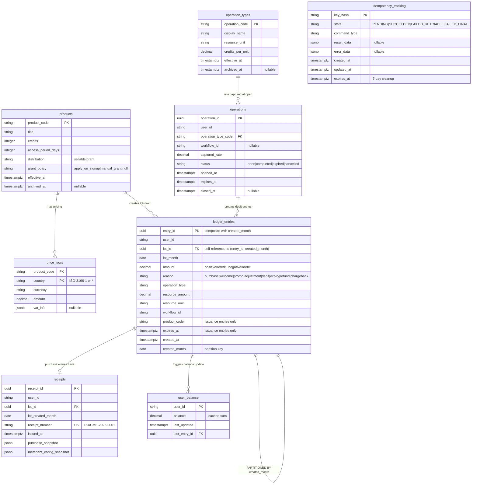
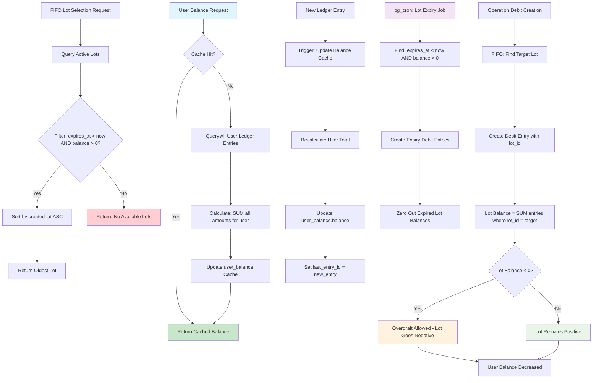

# 3. Database Schema & Migrations

## Purpose

Define comprehensive database schema design and migration strategies for the Credit Management Service, providing implementation-ready specifications for PostgreSQL-based multi-tenant architecture with optimal performance characteristics.

## 3.1 Schema Design

### Core Database Strategy

The Credit Management Service implements a **database-per-merchant** isolation strategy with PostgreSQL as the foundation. Each merchant operates in a completely isolated database, ensuring data security and enabling independent scaling per tenant.

**Research Foundation**: Based on analysis from [04_postgresql_multi_tenant_patterns.md](research/04_postgresql_multi_tenant_patterns.md) and [07_postgres_pg_cron_background_jobs.md](research/07_postgres_pg_cron_background_jobs.md).

### Core Tables Specification

#### ledger_entries (Immutable Financial Journal)

```sql
CREATE TABLE ledger_entries (
    entry_id          uuid NOT NULL DEFAULT gen_random_uuid(),
    user_id           text NOT NULL,
    -- IMPORTANT: lot_id is a SELF-REFERENCE to ledger_entries(entry_id)
    -- There is NO separate "lots" table. A "lot" IS a credit ledger entry.
    -- For credit entries (amount > 0): lot_id = entry_id (self-reference)
    -- For debit entries (amount < 0): lot_id references the original credit entry
    lot_id            uuid NOT NULL,
    lot_month         date NOT NULL,
    amount            integer NOT NULL,
    reason            text NOT NULL CHECK (reason IN (
        'purchase', 'welcome', 'promo', 'adjustment', 
        'debit', 'expiry', 'refund', 'chargeback'
    )),
    
    -- Operation Context
    operation_type    text NOT NULL,
    resource_amount   decimal(19,4),
    resource_unit     text,
    workflow_id       text,
    
    -- Issuance Context (NULL except for lot creation entries)
    product_code      text,
    expires_at        timestamptz,
    
    -- Audit
    created_at        timestamptz NOT NULL DEFAULT now(),
    -- Explicit partition key (UTC month of created_at)
    created_month     date NOT NULL,
    -- Composite primary key includes partition key
    PRIMARY KEY (entry_id, created_month)
);

-- Critical Financial Integrity Constraints
ALTER TABLE ledger_entries ADD CONSTRAINT ledger_entries_amount_not_zero 
    CHECK (amount != 0);
```

**Design Principles:**
- **Immutable Journal**: No updates or deletes allowed after creation
- **Lot = Initial Credit Entry**: The first credit entry's entry_id becomes the lot_id
- **Self-Referential Integrity**: All entries reference their target lot via lot_id
- **Credit Units as Integers**: Ledger amounts are integer credits; monetary values remain decimal elsewhere (prices, resource_amount)
- **Explicit Partitioning**: Application computes `created_month = date_trunc('month', created_at at time zone 'UTC')::date` and writes it; a CHECK constraint enforces consistency.

```sql
-- Enforce immutability: block UPDATE/DELETE on ledger_entries
CREATE OR REPLACE FUNCTION ledger_entries_immutable_trigger()
RETURNS trigger AS $$
BEGIN
    RAISE EXCEPTION 'ledger_entries are immutable; use compensating entries only';
END;
$$ LANGUAGE plpgsql;

CREATE TRIGGER ledger_entries_immutable
    BEFORE UPDATE OR DELETE ON ledger_entries
    FOR EACH ROW EXECUTE FUNCTION ledger_entries_immutable_trigger();

-- Auto-set lot_id for issuance (amount > 0) when not provided
CREATE OR REPLACE FUNCTION ledger_entries_set_lot_id()
RETURNS trigger AS $$
BEGIN
    IF NEW.amount > 0 THEN
        IF NEW.lot_id IS NULL THEN
            NEW.lot_id := NEW.entry_id;
        END IF;
        -- Ensure lot_month equals the entry's created_month for issuance entries
        NEW.lot_month := NEW.created_month;
    END IF;
    RETURN NEW;
END;
$$ LANGUAGE plpgsql;

CREATE TRIGGER ledger_entries_set_lot_id_trigger
    BEFORE INSERT ON ledger_entries
    FOR EACH ROW EXECUTE FUNCTION ledger_entries_set_lot_id();

-- Ensure created_month matches created_at (UTC)
ALTER TABLE ledger_entries
ADD CONSTRAINT ledger_entries_created_month_check
CHECK (
  created_month = (date_trunc('month', created_at AT TIME ZONE 'UTC'))::date
);

-- Self-reference across partitions using composite identity
ALTER TABLE ledger_entries
ADD CONSTRAINT ledger_entries_lot_fk
FOREIGN KEY (lot_id, lot_month) REFERENCES ledger_entries(entry_id, created_month)
DEFERRABLE INITIALLY DEFERRED;

-- Enforce issuance/debit context and composite identity rules
ALTER TABLE ledger_entries
ADD CONSTRAINT ledger_entries_role_context CHECK (
  (
    amount > 0 AND 
    product_code IS NOT NULL AND 
    expires_at IS NOT NULL AND 
    lot_id = entry_id AND 
    lot_month = created_month
  ) OR (
    amount <= 0 AND 
    product_code IS NULL AND 
    expires_at IS NULL
  )
);
```

#### products (Product Catalog Template)

```sql
CREATE TABLE products (
    product_code      text PRIMARY KEY,
    title             text NOT NULL,
    credits           integer NOT NULL CHECK (credits > 0),
    access_period_days integer NOT NULL CHECK (access_period_days > 0),
    distribution      text NOT NULL CHECK (distribution IN ('sellable', 'grant')),
    grant_policy      text CHECK (grant_policy IN ('apply_on_signup', 'manual_grant')),
    
    -- Lifecycle Management
    effective_at      timestamptz NOT NULL DEFAULT now(),
    archived_at       timestamptz,
    
    -- Constraints
    CONSTRAINT products_grant_policy_check CHECK (
        (distribution = 'grant' AND grant_policy IS NOT NULL) OR
        (distribution = 'sellable' AND grant_policy IS NULL)
    )
);

-- Immutability: Only archived_at can be updated
CREATE OR REPLACE FUNCTION products_immutable_trigger() 
RETURNS trigger AS $$
BEGIN
    IF TG_OP = 'UPDATE' AND (
        OLD.product_code != NEW.product_code OR
        OLD.title != NEW.title OR
        OLD.credits != NEW.credits OR
        OLD.access_period_days != NEW.access_period_days OR
        OLD.distribution != NEW.distribution OR
        OLD.grant_policy IS DISTINCT FROM NEW.grant_policy OR
        OLD.effective_at != NEW.effective_at
    ) THEN
        RAISE EXCEPTION 'Products are immutable except for archived_at';
    END IF;
    RETURN NEW;
END;
$$ LANGUAGE plpgsql;

CREATE TRIGGER products_immutable 
    BEFORE UPDATE ON products 
    FOR EACH ROW EXECUTE FUNCTION products_immutable_trigger();
```

#### price_rows (Country-Specific Pricing)

```sql
CREATE TABLE price_rows (
    product_code      text NOT NULL REFERENCES products(product_code),
    country           text NOT NULL, -- ISO-3166-1 alpha-2 or "*" for fallback
    currency          text NOT NULL,
    amount            decimal(19,4) NOT NULL CHECK (amount > 0),
    vat_info          jsonb, -- {"rate": 0.20, "amount": 1.67, "note": "UK VAT"}
    
    PRIMARY KEY (product_code, country)
);
```

Note: Pricing fallback behavior
- Fallback pricing (country = "*") is optional. The application resolves prices by first trying a country-specific row, then falling back to "*" if present. If neither exists, the product is treated as unavailable for that country and the purchase is rejected.

#### operations (Open Operation Guard & Audit Snapshot)

```sql
CREATE TABLE operations (
    operation_id        uuid PRIMARY KEY DEFAULT gen_random_uuid(),
    user_id             text NOT NULL,
    operation_type_code text NOT NULL REFERENCES operation_types(operation_code),
    workflow_id         text,
    captured_rate       decimal(19,6) NOT NULL CHECK (captured_rate > 0),
    status              text NOT NULL CHECK (status IN ('open', 'completed', 'expired', 'cancelled')),
    opened_at           timestamptz NOT NULL DEFAULT now(),
    expires_at          timestamptz NOT NULL,
    closed_at           timestamptz,
    CONSTRAINT operations_expiry_after_open CHECK (expires_at > opened_at)
);

-- Enforce at most one open operation per user globally (partial unique index)
CREATE UNIQUE INDEX IF NOT EXISTS operations_single_open_per_user 
    ON operations (user_id) 
    WHERE status = 'open';

-- Indexes to support cleanup and expiry scanning
CREATE INDEX IF NOT EXISTS operations_open_by_expiry_idx ON operations (expires_at) WHERE status = 'open';
CREATE INDEX IF NOT EXISTS operations_cleanup_idx ON operations (COALESCE(closed_at, opened_at)) WHERE status <> 'open';
```

#### operation_types (Rate Management)

```sql
CREATE TABLE operation_types (
    operation_code     text PRIMARY KEY,
    display_name       text NOT NULL,
    resource_unit      text NOT NULL,
    credits_per_unit   decimal(19,6) NOT NULL CHECK (credits_per_unit > 0),
    
    -- Sequential Versioning
    effective_at       timestamptz NOT NULL DEFAULT now(),
    archived_at        timestamptz,
    
    -- Lifecycle Integrity
    CONSTRAINT operation_types_lifecycle CHECK (
        archived_at IS NULL OR archived_at > effective_at
    )
);

-- Auto-archive previous versions
CREATE OR REPLACE FUNCTION auto_archive_operation_types()
RETURNS trigger AS $$
BEGIN
    UPDATE operation_types 
    SET archived_at = NEW.effective_at
    WHERE operation_code = NEW.operation_code 
      AND archived_at IS NULL 
      AND effective_at != NEW.effective_at;
    RETURN NEW;
END;
$$ LANGUAGE plpgsql;

CREATE TRIGGER auto_archive_operation_types_trigger
    BEFORE INSERT ON operation_types
    FOR EACH ROW EXECUTE FUNCTION auto_archive_operation_types();
```

#### idempotency_tracking (Duplicate Prevention)

```sql
-- IMPLEMENTATION NOTE: The 4-state design below represents maximum complexity
-- consideration. During implementation, consider starting with simpler 2-state 
-- approach ('PROCESSING', 'COMPLETED') and evolving based on real requirements
-- and developer team complexity assessment. Decision should be made during
-- implementation phase based on actual MVP needs vs future-proofing trade-offs.
CREATE TABLE idempotency_tracking (
    key_hash           text PRIMARY KEY,
    state              text NOT NULL CHECK (state IN (
        'PENDING', 'SUCCEEDED', 'FAILED_RETRIABLE', 'FAILED_FINAL'
    )),
    command_type       text NOT NULL,
    result_data        jsonb,
    error_data         jsonb,
    
    -- Timing
    created_at         timestamptz NOT NULL DEFAULT now(),
    updated_at         timestamptz NOT NULL DEFAULT now(),
    
    -- Cleanup Window
    expires_at         timestamptz NOT NULL DEFAULT (now() + interval '7 days'),
    
    -- Performance
    CONSTRAINT idempotency_state_transition CHECK (
        (state = 'PENDING' AND result_data IS NULL) OR
        (state = 'SUCCEEDED' AND result_data IS NOT NULL) OR
        (state IN ('FAILED_RETRIABLE', 'FAILED_FINAL') AND error_data IS NOT NULL)
    )
);

-- Cleanup index for expired entries
CREATE INDEX idempotency_tracking_cleanup_idx 
    ON idempotency_tracking (expires_at) 
    WHERE state IN ('SUCCEEDED', 'FAILED_FINAL');
 
-- Maintain updated_at timestamp on update
CREATE OR REPLACE FUNCTION idempotency_touch_updated_at()
RETURNS trigger AS $$
BEGIN
    NEW.updated_at := now();
    RETURN NEW;
END;
$$ LANGUAGE plpgsql;

CREATE TRIGGER idempotency_touch_updated_at_trigger
    BEFORE UPDATE ON idempotency_tracking
    FOR EACH ROW EXECUTE FUNCTION idempotency_touch_updated_at();
```

#### receipts (Purchase Documentation)

```sql
CREATE TABLE receipts (
    receipt_id         uuid PRIMARY KEY DEFAULT gen_random_uuid(),
    user_id            text NOT NULL,
    lot_id             uuid NOT NULL,
    lot_created_month  date NOT NULL,
    receipt_number     text NOT NULL UNIQUE DEFAULT generate_receipt_number(), -- "R-ACME-2025-0001"
    issued_at          timestamptz NOT NULL DEFAULT now(),
    -- Immutable Snapshots
    purchase_snapshot  jsonb NOT NULL,
    merchant_config_snapshot  jsonb NOT NULL,
    -- Enforce one receipt per lot
    UNIQUE (lot_id),
    -- Composite FK to partitioned ledger identity
    FOREIGN KEY (lot_id, lot_created_month) REFERENCES ledger_entries(entry_id, created_month)
);

-- Sequential receipt numbering per merchant
CREATE SEQUENCE receipt_number_seq;

CREATE OR REPLACE FUNCTION generate_receipt_number()
RETURNS text AS $$
DECLARE
    merchant_prefix text := 'R-' || upper(current_setting('app.merchant_id', true)) || '-';
    year_part text := extract(year from now())::text;
    seq_num text := lpad(nextval('receipt_number_seq')::text, 4, '0');
BEGIN
    RETURN merchant_prefix || year_part || '-' || seq_num;
END;
$$ LANGUAGE plpgsql;
```

Note: Audit Retention
- `ledger_entries` is audit-critical and must never be dropped. Partitioning exists for performance and maintenance only. Long-term retention is achieved via per-merchant backups and point-in-time recovery.

#### user_balance (Performance Cache)

```sql
CREATE TABLE user_balance (
    user_id            text PRIMARY KEY,
    balance            integer NOT NULL DEFAULT 0,
    last_updated       timestamptz NOT NULL DEFAULT now(),
    last_entry_id      uuid NOT NULL,
    last_entry_month   date NOT NULL,
    CONSTRAINT user_balance_last_entry_fk FOREIGN KEY (last_entry_id, last_entry_month)
      REFERENCES ledger_entries(entry_id, created_month)
);

-- Ensure balance accuracy with trigger
CREATE OR REPLACE FUNCTION update_user_balance()
RETURNS trigger AS $$
BEGIN
    INSERT INTO user_balance (user_id, balance, last_entry_id, last_entry_month)
    VALUES (NEW.user_id, NEW.amount, NEW.entry_id, NEW.created_month)
    ON CONFLICT (user_id) 
    DO UPDATE SET 
        balance = user_balance.balance + NEW.amount,
        last_updated = now(),
        last_entry_id = NEW.entry_id,
        last_entry_month = NEW.created_month;
    RETURN NEW;
END;
$$ LANGUAGE plpgsql;

CREATE TRIGGER update_user_balance_trigger
    AFTER INSERT ON ledger_entries
    FOR EACH ROW EXECUTE FUNCTION update_user_balance();
```

### Partitioning Strategy

#### Monthly Partition Design

**High-Volume Tables**: Only `ledger_entries` uses monthly range partitioning via explicit `created_month` column and composite PK `(entry_id, created_month)`. `operations` remains unpartitioned with a partial unique index for open‑operation exclusivity and a short retention policy for closed rows.

```sql
-- Automated Monthly Partition Creation
CREATE OR REPLACE FUNCTION create_monthly_partitions(
    table_name text,
    months_ahead integer DEFAULT 3
) RETURNS void AS $$
DECLARE
    partition_date date;
    partition_name text;
    start_date text;
    end_date text;
BEGIN
    FOR i IN 0..months_ahead LOOP
        partition_date := date_trunc('month', now()) + (i || ' months')::interval;
        partition_name := table_name || '_' || to_char(partition_date, 'YYYY_MM');
        start_date := partition_date::text;
        end_date := (partition_date + interval '1 month')::text;
        
        EXECUTE format(
            'CREATE TABLE IF NOT EXISTS %I PARTITION OF %I 
             FOR VALUES FROM (%L) TO (%L)',
            partition_name, table_name, start_date, end_date
        );
        
        -- Create partition-specific indexes for ledger pruning
        IF table_name = 'ledger_entries' THEN
          EXECUTE format(
            'CREATE INDEX IF NOT EXISTS %I ON %I (user_id, expires_at, created_at) WHERE amount > 0',
            partition_name || '_fifo_idx', partition_name
          );
          EXECUTE format(
            'CREATE INDEX IF NOT EXISTS %I ON %I (user_id, created_at DESC)',
            partition_name || '_balance_idx', partition_name
          );
        END IF;
    END LOOP;
END;
$$ LANGUAGE plpgsql;

-- Initialize partitions for current and future months
SELECT create_monthly_partitions('ledger_entries', 6);
```

#### Partition Maintenance Strategy

```sql
-- Partition cleanup disabled for audit table (ledger_entries)
-- Retention is handled via backups/archival policies; do not drop partitions.
CREATE OR REPLACE FUNCTION cleanup_old_partitions_audit_safe(
    table_name text,
    retention_months integer DEFAULT 24
) RETURNS void AS $$
DECLARE
    cutoff_date date := date_trunc('month', now()) - (retention_months || ' months')::interval;
    partition_record record;
BEGIN
    FOR partition_record IN
        SELECT schemaname, tablename
        FROM pg_tables
        WHERE tablename LIKE table_name || '_____[_]__'
          AND schemaname = current_schema()
    LOOP
        IF to_date(substring(partition_record.tablename from '(\d{4}_\d{2})$'), 'YYYY_MM') < cutoff_date THEN
            -- Disabled: Do not drop partitions for audit table (ledger_entries)
            RAISE NOTICE 'Skipping partition drop for %.% due to audit retention policy',
                         partition_record.schemaname,
                         partition_record.tablename;
        END IF;
    END LOOP;
END;
$$ LANGUAGE plpgsql;
```

### Performance Indexes

#### Critical Business Operation Indexes

```sql
-- FIFO Lot Selection (most critical query)
CREATE INDEX ledger_entries_fifo_selection_idx 
    ON ledger_entries (user_id, expires_at, created_at)
    WHERE amount > 0;

-- Balance Calculation Performance
CREATE INDEX ledger_entries_balance_calc_idx 
    ON ledger_entries (user_id, created_at DESC);

-- Operation Lookup and Expiry
CREATE INDEX operations_expiry_cleanup_idx 
    ON operations (expires_at, status)
    WHERE status = 'open';

-- Receipt Generation
CREATE INDEX receipts_user_lookup_idx 
    ON receipts (user_id, issued_at DESC);

-- Product Catalog Active Lookup
CREATE INDEX products_active_lookup_idx 
    ON products (distribution, effective_at)
    WHERE archived_at IS NULL;

-- (Removed) Previously documented an index for price resolution. Since fallback is optional and resolved in application logic, index strategy can evolve with real query patterns. A simple composite index on (product_code, country) may still be added during implementation if measurements show it helps.
```

## 3.2 Migration System Design

### Effect PgMigrator Integration

The Credit Management Service uses Effect's PgMigrator for type-safe, composable database migrations with per-merchant execution.

```typescript
// packages/shared/src/migrations/MigrationService.ts
import { Effect, Context, Layer } from 'effect'
import { PgMigrator } from '@effect/sql-pg'
import { DatabaseContext } from '../infrastructure/DatabaseService'

export class MigrationService extends Context.Tag('MigrationService')<
  MigrationService,
  {
    runMigrations: () => Effect.Effect<void, Error>
    rollbackMigration: (version: number) => Effect.Effect<void, Error>
    getMigrationStatus: () => Effect.Effect<MigrationStatus[], Error>
  }
>() {}

export const MigrationServiceLive = Layer.effect(
  MigrationService,
  Effect.gen(function* (_) {
    const db = yield* _(DatabaseContext)
    
    const migrator = PgMigrator.make({
      loader: PgMigrator.fromFileSystem({
        directory: './migrations'
      }),
      schemaDirectory: './schema',
      table: 'schema_migrations'
    })

    return MigrationService.of({
      runMigrations: () =>
        Effect.gen(function* (_) {
          yield* _(Effect.log('Starting database migrations'))
          const results = yield* _(migrator.run)
          yield* _(Effect.logInfo(`Applied ${results.length} migrations`))
        }),

      rollbackMigration: (version: number) =>
        Effect.gen(function* (_) {
          yield* _(Effect.log(`Rolling back to version ${version}`))
          yield* _(migrator.rollbackTo(version))
          yield* _(Effect.logInfo('Rollback completed'))
        }),

      getMigrationStatus: () =>
        Effect.gen(function* (_) {
          return yield* _(migrator.getStatus())
        })
    })
  })
)
```

### Migration File Structure

```
migrations/
  001_initial_schema.sql
  002_create_partitions.sql
  003_enable_background_jobs.sql
  004_add_performance_indexes.sql
  rollback/
    001_initial_schema.sql
    002_create_partitions.sql
    003_enable_background_jobs.sql
```

### Per-Merchant Migration Execution

Environment Variables Convention
- Provide `MERCHANT_{ID}_DATABASE_URL` per merchant. This keeps the service provider‑agnostic and works with any managed Postgres.

```typescript
// packages/shared/src/migrations/MultiTenantMigrator.ts
export class MultiTenantMigrator {
  constructor(
    private dbManager: DatabaseManager,
    private migrationService: MigrationService
  ) {}

  async runAllMerchantMigrations(): Promise<void> {
    const merchantIds = this.getAllMerchantIds()
    
    for (const merchantId of merchantIds) {
      await this.runMerchantMigrations(merchantId)
    }
  }

  private async runMerchantMigrations(merchantId: string): Promise<void> {
    const pool = this.dbManager.getConnection(merchantId)
    
    await pipe(
      this.migrationService.runMigrations(),
      Effect.provideService(DatabaseContext, {
        merchantId,
        pool
      }),
      Effect.runPromise
    )
  }

  private getAllMerchantIds(): string[] {
    return Object.keys(process.env)
      .filter((k) => k.startsWith('MERCHANT_') && k.endsWith('_DATABASE_URL'))
      .map((k) => k.replace('MERCHANT_', '').replace('_DATABASE_URL', '').toLowerCase())
  }
}
```

### Core Migration Files

#### 001_initial_schema.sql
```sql
-- Enable extensions
-- pgcrypto: provides gen_random_uuid() used as DEFAULT in tables
CREATE EXTENSION IF NOT EXISTS pgcrypto;
-- uuid-ossp: optional alternative UUID generator (kept for flexibility)
CREATE EXTENSION IF NOT EXISTS "uuid-ossp";
-- pg_cron: background job scheduling within Postgres
CREATE EXTENSION IF NOT EXISTS pg_cron;

-- Create application schema for jobs
CREATE SCHEMA IF NOT EXISTS app;

-- Create all core tables (as defined above)
-- ... (tables would be defined here)
```

#### 002_create_partitions.sql
```sql
-- Initialize monthly partitions for high-volume tables
SELECT create_monthly_partitions('ledger_entries', 6);

-- Schedule automatic partition creation
SELECT cron.schedule(
  'create_future_partitions',
  '0 0 1 * *', -- First day of each month
  $$SELECT create_monthly_partitions('ledger_entries', 3);$$
);
```

#### 003_enable_background_jobs.sql
```sql
-- Job execution tracking
CREATE TABLE app.job_runs (
  id            bigserial PRIMARY KEY,
  job_name      text NOT NULL,
  started_at    timestamptz NOT NULL DEFAULT now(),
  finished_at   timestamptz,
  affected_rows integer,
  error         text
);

-- Schedule background jobs (as defined in research/07_postgres_pg_cron_background_jobs.md)
SELECT cron.schedule('ops_cleanup', '*/5 * * * *', $$CALL app.cleanup_expired_operations()$$);
SELECT cron.schedule('lot_expiry', '0 2 * * *', $$CALL app.expire_lots()$$);
SELECT cron.schedule('idempotency_cleanup', '0 3 * * *', $$CALL app.cleanup_idempotency()$$);
```

### Migration Rollback Strategy

```sql
-- rollback/001_initial_schema.sql
DROP SCHEMA IF EXISTS app CASCADE;
DROP TABLE IF EXISTS receipts CASCADE;
DROP TABLE IF EXISTS user_balance CASCADE;
DROP TABLE IF EXISTS idempotency_tracking CASCADE;
DROP TABLE IF EXISTS operation_types CASCADE;
DROP TABLE IF EXISTS operations CASCADE;
DROP TABLE IF EXISTS price_rows CASCADE;
DROP TABLE IF EXISTS products CASCADE;
DROP TABLE IF EXISTS ledger_entries CASCADE;
DROP EXTENSION IF EXISTS pg_cron;
```

### Schema Evolution Considerations

#### Version-Based Product Updates
```sql
-- Instead of updating products, create new versions
CREATE OR REPLACE FUNCTION create_product_version(
    base_product_code text,
    new_credits integer,
    new_period_days integer
) RETURNS text AS $$
DECLARE
    version_suffix text := '_v' || to_char(now(), 'YYYYMMDDHH24MISS');
    new_product_code text := base_product_code || version_suffix;
BEGIN
    -- Archive old version
    UPDATE products 
    SET archived_at = now()
    WHERE product_code = base_product_code 
      AND archived_at IS NULL;

    -- Create new version
    INSERT INTO products (
        product_code, title, credits, access_period_days, 
        distribution, grant_policy
    )
    SELECT 
        new_product_code,
        title,
        new_credits,
        new_period_days,
        distribution,
        grant_policy
    FROM products 
    WHERE product_code = base_product_code;

    -- Copy pricing
    INSERT INTO price_rows (product_code, country, currency, amount, vat_info)
    SELECT new_product_code, country, currency, amount, vat_info
    FROM price_rows 
    WHERE product_code = base_product_code;

    RETURN new_product_code;
END;
$$ LANGUAGE plpgsql;
```

## Essential Figures

### Figure 3.1: Database Schema Relationships



**Schema Design Principles:**
- **Lot = Initial Credit Entry**: No separate lot table; ledger is source of truth
- **Monthly Partitioning**: `ledger_entries` partitioned by month (explicit key)
- **Financial Integrity**: Decimal precision, immutable entries, comprehensive constraints
- **Multi-Tenant Isolation**: Each merchant has separate database with identical schema
- **Performance Optimization**: Strategic indexes for FIFO, balance calculation, and cleanup operations

### Figure 3.2: Balance Calculation Flow (Ledger → FIFO → Cache)



**Balance Calculation Principles:**
- **Real-time Accuracy**: Balance = SUM(all ledger_entries.amount for user)
- **Performance Cache**: `user_balance` table updated via triggers
- **FIFO Consumption**: Oldest non-expired lot with positive balance selected first
- **Overdraft Support**: Individual lots can go negative while preserving FIFO order
- **Automated Maintenance**: Background jobs handle expiry and cleanup operations

### Implementation Notes for Future Development

#### Migration Strategy Evolution
- **Zero-Downtime Migrations**: Future complex schema changes should use online migration patterns with shadow tables
- **Cross-Merchant Consistency**: Consider migration orchestration tools for managing updates across hundreds of merchant databases
- **Schema Validation**: Implement automated schema drift detection between merchant databases

#### Performance Optimization
- **Partition Pruning Validation**: Monitor `EXPLAIN ANALYZE` results to ensure partition elimination is working effectively
- **Index Usage Patterns**: Track slow query logs and optimize indexes based on actual usage patterns
- **Connection Pool Tuning**: Adjust per-merchant connection pool sizes based on load testing results

#### Operational Considerations
- **Backup Strategy**: Implement per-merchant backup strategies with point-in-time recovery capabilities
- **Monitoring**: Set up partition size monitoring and automated alerts for unusual growth patterns
- **Capacity Planning**: Monitor partition sizes and implement automated scaling triggers for high-volume merchants

This database schema provides a robust foundation for the Credit Management Service with built-in performance optimization, financial integrity guarantees, and operational maintainability. The design supports the multi-tenant architecture while enabling independent scaling and maintenance per merchant.
