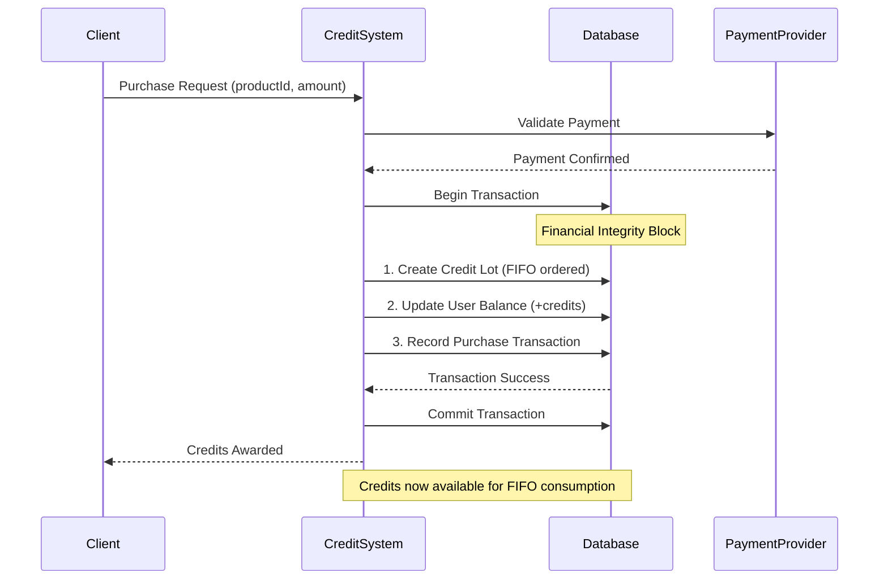
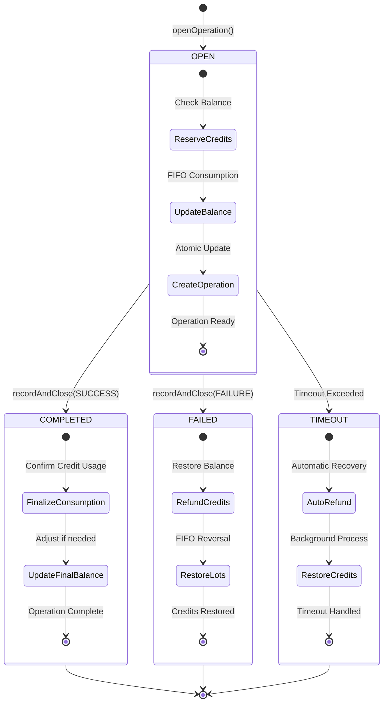
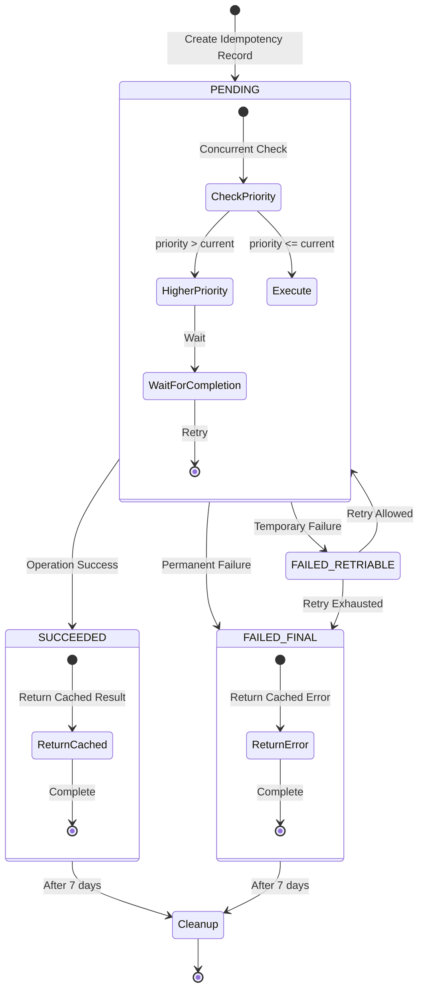

# 5. Core Business Logic

## Overview

The core business logic implements the financial operations and idempotency guarantees for the Credit Management Service. It follows a ledger‑first model: append‑only `ledger_entries`, no reservations, two‑phase operations, integer credit units, and one receipt per purchase. This section aligns with `01_business_domain_architecture.md` and `02_system_architecture_overview.md`.

## 5.1 Financial Operations & Idempotency

### Purchase Settlement Flow (payment → lot + receipt)

Purchase settlement creates a single credit lot (the initial credit ledger entry) and one receipt, atomically.

Key rules
- Product lookup by `product_code`; validate pricing snapshot (country → fallback `*` if present; tax posture from merchant config).
- Create one credit LedgerEntry with `amount = product.credits` (integer), `reason = 'purchase'`.
- The initial entry’s `entry_id` is the `lot_id`. Set issuance context on the entry: `product_code`, `expires_at = settled_at + product.access_period_days`.
- Generate one receipt linked to `lot_id` and snapshot merchant config and purchase details.
- Balance cache updates via trigger on `ledger_entries` (no manual balance writes).
- Idempotent by external payment reference (via Idempotency-Key).

Pseudocode
```typescript
import { Effect } from "effect"
import { SqlClient } from "@effect/sql"

interface SettlePurchaseInput {
  userId: string
  productCode: string
  pricingSnapshot: { country: string; currency: string; amount: number; taxBreakdown?: unknown }
  externalRef: string
  orderPlacedAt: Date
  settledAt: Date
}

const settlePurchase = (input: SettlePurchaseInput) =>
  Effect.gen(function* (_) {
    const sql = yield* _(SqlClient.SqlClient)
    return yield* _(sql.withTransaction(
      Effect.gen(function* (_) {
        const product = yield* _(Products.getActiveByCode(input.productCode, input.orderPlacedAt))
        yield* _(Pricing.validateSnapshot(product, input.pricingSnapshot, input.orderPlacedAt))

        const entry = yield* _<any>(sql`
          INSERT INTO ledger_entries (
            user_id, lot_id, amount, reason,
            operation_type, resource_amount, resource_unit, workflow_id,
            product_code, expires_at
          )
          VALUES (
            ${input.userId}, gen_random_uuid(), ${product.credits}, 'purchase',
            ${'payment'}, ${input.pricingSnapshot.amount}, ${input.pricingSnapshot.currency}, ${input.externalRef},
            ${input.productCode}, ${sql.fn('timestamptz', input.settledAt)} + (${product.access_period_days} || ' days')::interval
          )
          RETURNING entry_id as lot_id, created_at as issued_at, expires_at
        `)

        const receipt = yield* _<any>(sql`
          INSERT INTO receipts (user_id, lot_id, receipt_number, purchase_snapshot, merchant_config_snapshot)
          VALUES (
            ${input.userId}, ${entry.lot_id}, generate_receipt_number(),
            ${sql.jsonb({ productCode: input.productCode, ...input.pricingSnapshot, externalRef: input.externalRef })},
            ${sql.jsonb(yield* _(Merchant.getConfig()))}
          )
          RETURNING receipt_id, receipt_number, issued_at
        `)

        const balance = yield* _(Balances.getCached(input.userId))
        return {
          lot: { lotId: entry.lot_id, creditsTotal: product.credits, expiresAt: entry.expires_at, issuedAt: entry.issued_at },
          receipt: { receiptId: receipt.receipt_id, receiptNumber: receipt.receipt_number, issuedAt: receipt.issued_at },
          userBalance: balance
        }
      })
    ))
  })
```

### Operation Lifecycle Management (Open → RecordAndClose)

Operations are two‑phase. Open captures the applicable rate and context without modifying balance. RecordAndClose computes credits from the captured rate and debits via FIFO.

Open
```typescript
const openOperation = (input: { userId: string; operationTypeCode: string; workflowId?: string; timeoutMinutes?: number }) =>
  Effect.gen(function* (_) {
    const sql = yield* _(SqlClient.SqlClient)
    const opType = yield* _(OperationTypes.getActive(input.operationTypeCode))
    const expiresAt = yield* _(Operations.computeExpiry(input.timeoutMinutes))
    const balance = yield* _(Balances.getCached(input.userId))
    if (balance.balance < 0) yield* _(Effect.fail(new InsufficientBalance({ currentBalance: balance.balance })))
    const operation = yield* _<any>(sql`
      INSERT INTO operations (user_id, operation_type_code, workflow_id, captured_rate, status, opened_at, expires_at)
      VALUES (${input.userId}, ${input.operationTypeCode}, ${input.workflowId ?? null}, ${opType.credits_per_unit}, 'open', now(), ${expiresAt})
      RETURNING operation_id, opened_at, expires_at, captured_rate
    `)
    return { operationId: operation.operation_id, status: 'open', capturedRate: operation.captured_rate, openedAt: operation.opened_at, expiresAt: operation.expires_at }
  })
```

RecordAndClose
```typescript
const recordAndClose = (input: { operationId: string; resourceAmount: number; completedAt: Date }) =>
  Effect.gen(function* (_) {
    const sql = yield* _(SqlClient.SqlClient)
    return yield* _(sql.withTransaction(
      Effect.gen(function* (_) {
        const op = yield* _(Operations.getOpen(input.operationId))
        const debitCredits = Math.max(1, Math.ceil(input.resourceAmount * op.captured_rate))
        const lot = yield* _(Ledger.selectOldestEligibleLot(op.user_id, new Date()))
        if (!lot) yield* _(Effect.fail(new InsufficientBalance({ currentBalance: 0, requiredBalance: debitCredits })))
        const entry = yield* _<any>(sql`
          INSERT INTO ledger_entries (user_id, lot_id, amount, reason, operation_type, resource_amount, resource_unit, workflow_id)
          VALUES (${op.user_id}, ${lot.lot_id}, ${-debitCredits}, 'debit', ${op.operation_type_code}, ${input.resourceAmount}, ${op.resource_unit}, ${op.workflow_id})
          RETURNING entry_id, created_at
        `)
        yield* _(sql`UPDATE operations SET status = 'completed' WHERE operation_id = ${op.operation_id}`)
        const balance = yield* _(Balances.getCached(op.user_id))
        return { operation: { operationId: op.operation_id, status: 'completed', finalCost: debitCredits, completedAt: input.completedAt }, ledgerEntry: { entryId: entry.entry_id, lotId: lot.lot_id, amount: -debitCredits, createdAt: entry.created_at }, userBalance: balance }
      })
    ))
  })
```

Notes
- Open does not reserve or debit credits.
- FIFO selection and debiting occur in RecordAndClose.
- Expired operations fail with `OperationExpired`.
- All amounts are integer credits; money amounts and rates remain decimals.

### Grants, Adjustments, Refunds, Chargebacks

Grants (Welcome/Promo)
- Issue a credit lot using a grant product. Create a credit ledger entry with `reason = 'welcome' | 'promo'` and standard expiry from `access_period_days`.
- Idempotent per business rule (e.g., maximum one welcome grant per user).

CreditAdjustment.Apply (Administrative)
- Create a credit lot with `reason = 'adjustment'` using an ephemeral product template (`credits`, `access_period_days`, justification).
- Idempotency: detect duplicates by a provided idempotency key; no receipts.

Refund.Apply
- Create negative ledger entry equal to original purchase credits, `reason = 'refund'`, linked to original lot via business lookup (externalRef → purchase).
- Idempotent by `externalRef`.

Chargeback.Apply
- Provider‑initiated reversal, `reason = 'chargeback'`, same credit amount as original purchase; no receipt; idempotent by `externalRef`.

#### Control App Command Examples (pseudocode)

Welcome Grant (idempotent per user)
```typescript
const applyWelcomeGrant = (input: { userId: string }) =>
  Effect.gen(function* (_) {
    const sql = yield* _(SqlClient.SqlClient)
    // Ensure no prior welcome grant
    const exists = yield* _<any>(sql`
      SELECT 1 FROM ledger_entries 
      WHERE user_id = ${input.userId} AND reason = 'welcome' LIMIT 1
    `)
    if (exists.length) return yield* _(Effect.fail(new DuplicateAdminAction('welcome')))

    // Find active welcome product
    const product = yield* _(Products.getActiveGrant({ policy: 'apply_on_signup' }))
    const entry = yield* _<any>(sql`
      INSERT INTO ledger_entries (
        user_id, lot_id, amount, reason,
        operation_type, resource_amount, resource_unit, workflow_id,
        product_code, expires_at
      ) VALUES (
        ${input.userId}, gen_random_uuid(), ${product.credits}, 'welcome',
        ${'welcome_grant'}, null, null, ${'welcome:' + input.userId},
        ${product.product_code}, now() + (${product.access_period_days} || ' days')::interval
      ) RETURNING entry_id as lot_id, created_at as issued_at, expires_at
    `)
    const balance = yield* _(Balances.getCached(input.userId))
    return { lot: { lotId: entry.lot_id, creditsTotal: product.credits, expiresAt: entry.expires_at, issuedAt: entry.issued_at }, userBalance: balance }
  })
```

Promotional Grant
```typescript
const applyPromoGrant = (input: { userId: string; productCode: string; campaignId?: string }) =>
  Effect.gen(function* (_) {
    const sql = yield* _(SqlClient.SqlClient)
    const product = yield* _(Products.getActiveGrantByCode(input.productCode))
    const entry = yield* _<any>(sql`
      INSERT INTO ledger_entries (
        user_id, lot_id, amount, reason,
        operation_type, resource_amount, resource_unit, workflow_id,
        product_code, expires_at
      ) VALUES (
        ${input.userId}, gen_random_uuid(), ${product.credits}, 'promo',
        ${'promo_grant'}, null, null, ${'campaign:' + (input.campaignId ?? product.product_code)},
        ${product.product_code}, now() + (${product.access_period_days} || ' days')::interval
      ) RETURNING entry_id as lot_id, created_at as issued_at, expires_at
    `)
    const balance = yield* _(Balances.getCached(input.userId))
    return { lot: { lotId: entry.lot_id, creditsTotal: product.credits, expiresAt: entry.expires_at, issuedAt: entry.issued_at }, userBalance: balance }
  })
```

CreditAdjustment.Apply (no receipt)
```typescript
const applyCreditAdjustment = (input: { userId: string; creditAmount: number; accessPeriodDays: number; justification: string; adminActor: string }) =>
  Effect.gen(function* (_) {
    const sql = yield* _(SqlClient.SqlClient)
    const code = `credit_adj_${Date.now()}`
    const entry = yield* _<any>(sql`
      INSERT INTO ledger_entries (
        user_id, lot_id, amount, reason,
        operation_type, resource_amount, resource_unit, workflow_id,
        product_code, expires_at
      ) VALUES (
        ${input.userId}, gen_random_uuid(), ${input.creditAmount}, 'adjustment',
        ${'credit_adjustment'}, null, null, ${'admin:' + input.adminActor + ':' + input.justification},
        ${code}, now() + (${input.accessPeriodDays} || ' days')::interval
      ) RETURNING entry_id as lot_id, created_at as issued_at, expires_at
    `)
    const balance = yield* _(Balances.getCached(input.userId))
    return { lot: { lotId: entry.lot_id, creditsTotal: input.creditAmount, expiresAt: entry.expires_at, issuedAt: entry.issued_at }, userBalance: balance }
  })
```

Refund.Apply (idempotent by externalRef)
```typescript
const applyRefund = (input: { userId: string; externalRef: string; justification: string; adminActor: string }) =>
  Effect.gen(function* (_) {
    const sql = yield* _(SqlClient.SqlClient)
    // Locate original purchase lot by externalRef stored in workflow_id
    const purchase = yield* _<any>(sql`
      SELECT entry_id, amount, resource_amount, resource_unit
      FROM ledger_entries 
      WHERE user_id = ${input.userId} AND reason = 'purchase' AND workflow_id = ${input.externalRef}
      LIMIT 1
    `)
    if (!purchase.length) return yield* _(Effect.fail(new PurchaseNotFound(input.externalRef)))
    // Check duplicate refund
    const dup = yield* _<any>(sql`
      SELECT 1 FROM ledger_entries WHERE reason = 'refund' AND workflow_id = ${input.externalRef} LIMIT 1
    `)
    if (dup.length) return yield* _(Effect.fail(new DuplicateRefund(input.externalRef)))
    const credits = Math.abs(purchase[0].amount) // original purchase credits
    const entry = yield* _<any>(sql`
      INSERT INTO ledger_entries (user_id, lot_id, amount, reason, operation_type, resource_amount, resource_unit, workflow_id)
      VALUES (${input.userId}, ${purchase[0].entry_id}, ${-credits}, 'refund', ${'refund'}, ${purchase[0].resource_amount}, ${purchase[0].resource_unit}, ${input.externalRef})
      RETURNING entry_id, created_at
    `)
    const balance = yield* _(Balances.getCached(input.userId))
    return { ledgerEntry: { entryId: entry.entry_id, lotId: purchase[0].entry_id, amount: -credits, createdAt: entry.created_at }, userBalance: balance }
  })
```

Chargeback.Apply (provider‑initiated)
```typescript
const applyChargeback = (input: { userId: string; externalRef: string; category?: string }) =>
  Effect.gen(function* (_) {
    const sql = yield* _(SqlClient.SqlClient)
    const purchase = yield* _<any>(sql`
      SELECT entry_id, amount, resource_amount, resource_unit
      FROM ledger_entries 
      WHERE user_id = ${input.userId} AND reason = 'purchase' AND workflow_id = ${input.externalRef}
      LIMIT 1
    `)
    if (!purchase.length) return yield* _(Effect.fail(new PurchaseNotFound(input.externalRef)))
    const dup = yield* _<any>(sql`
      SELECT 1 FROM ledger_entries WHERE reason = 'chargeback' AND workflow_id = ${input.externalRef} LIMIT 1
    `)
    if (dup.length) return yield* _(Effect.fail(new DuplicateChargeback(input.externalRef)))
    const credits = Math.abs(purchase[0].amount)
    const entry = yield* _<any>(sql`
      INSERT INTO ledger_entries (user_id, lot_id, amount, reason, operation_type, resource_amount, resource_unit, workflow_id)
      VALUES (${input.userId}, ${purchase[0].entry_id}, ${-credits}, 'chargeback', ${'chargeback'}, ${purchase[0].resource_amount}, ${purchase[0].resource_unit}, ${input.externalRef})
      RETURNING entry_id, created_at
    `)
    const balance = yield* _(Balances.getCached(input.userId))
    return { ledgerEntry: { entryId: entry.entry_id, lotId: purchase[0].entry_id, amount: -credits, createdAt: entry.created_at }, userBalance: balance }
  })
```

### 4-State Idempotency System

The idempotency system uses a 4‑state machine (PENDING/SUCCEEDED/FAILED_RETRIABLE/FAILED_FINAL) with deterministic UUIDv5 transaction IDs backed by the `idempotency_tracking` table. Priority‑1 ops return stored results on duplicate; admin ops detect conflicts.

```typescript
// Idempotency State Machine
type IdempotencyState = 
  | 'PENDING'
  | 'SUCCEEDED' 
  | 'FAILED_RETRIABLE'
  | 'FAILED_FINAL'

interface IdempotencyRecord {
  transactionId: string
  operationType: string
  state: IdempotencyState
  requestHash: string
  responseData?: any
  errorDetails?: any
  priority: number
  createdAt: Date
  updatedAt: Date
  expiresAt: Date
}

const processWithIdempotency = <T>(
  transactionId: string,
  operationType: string,
  requestData: any,
  operation: Effect.Effect<T, any>
) =>
  Effect.gen(function* () {
    const sql = yield* SqlClient.SqlClient
    
    // 1. Generate deterministic transaction ID if not provided
    const finalTransactionId = transactionId || generateDeterministicId(operationType, requestData)
    const requestHash = hashRequest(requestData)
    
    // 2. Check for existing idempotency record
    const existing = yield* sql`
      SELECT key_hash as transaction_id, state, result_data, error_data
      FROM idempotency_tracking
      WHERE key_hash = ${finalTransactionId}
    `
    
    if (existing.length > 0) {
      const record = existing[0]
      
      switch (record.state) {
        case 'SUCCEEDED':
          // Return cached successful result
          return record.result_data
          
        case 'FAILED_FINAL':
          // Fail immediately with cached error
          yield* Effect.fail(new IdempotencyError(record.error_data))
          
        case 'FAILED_RETRIABLE':
          // Check if retry is allowed (exponential backoff)
          if (shouldRetry(record)) {
            break // Continue to execute operation
          } else {
            yield* Effect.fail(new RetryExhaustedError())
          }
          
        case 'PENDING':
          // Handle concurrent execution based on priority
          if (record.priority > getPriority(requestData)) {
            // Wait for higher priority operation
            yield* waitForCompletion(finalTransactionId)
            return yield* processWithIdempotency(transactionId, operationType, requestData, operation)
          } else {
            // Take over lower priority operation
            yield* sql`
              UPDATE idempotency_records 
              SET priority = ${getPriority(requestData)}, request_hash = ${requestHash}
              WHERE transaction_id = ${finalTransactionId}
            `
          }
      }
    } else {
      // 3. Create new idempotency record in PENDING state
      yield* sql`
        INSERT INTO idempotency_tracking (key_hash, state, command_type, created_at, updated_at, expires_at)
        VALUES (${finalTransactionId}, 'PENDING', ${operationType}, now(), now(), now() + interval '7 days')
      `
    }
    
    // 4. Execute operation with state tracking
    return yield* Effect.tryPromise({
      try: async () => {
        try {
          const result = await Effect.runPromise(operation)
          
          // Mark as succeeded
          await Effect.runPromise(sql`
            UPDATE idempotency_tracking 
            SET state = 'SUCCEEDED', result_data = ${JSON.stringify(result)}, 
                updated_at = now()
            WHERE key_hash = ${finalTransactionId}
          `)
          
          return result
        } catch (error) {
          const isRetriable = isRetriableError(error)
          const finalState = isRetriable ? 'FAILED_RETRIABLE' : 'FAILED_FINAL'
          
          // Mark as failed
          await Effect.runPromise(sql`
            UPDATE idempotency_tracking 
            SET state = ${finalState}, error_data = ${JSON.stringify(error)}, 
                updated_at = now()
            WHERE key_hash = ${finalTransactionId}
          `)
          
          throw error
        }
      },
      catch: (error) => new OperationExecutionError(error)
    })
  })

// UUIDv5 Deterministic ID Generation
const generateDeterministicId = (operationType: string, requestData: any): string => {
  const namespace = "6ba7b810-9dad-11d1-80b4-00c04fd430c8" // Credit Lodger namespace
  const seedData = `${operationType}:${hashRequest(requestData)}`
  return uuidv5(seedData, namespace)
}

// 7-day cleanup process
const cleanupExpiredRecords = Effect.gen(function* () {
  const sql = yield* SqlClient.SqlClient
  
  yield* sql`
    DELETE FROM idempotency_records 
    WHERE expires_at < ${new Date()} 
    AND state IN ('SUCCEEDED', 'FAILED_FINAL')
  `
})
```

## Essential Figures

### Figure 5.1: Purchase Settlement Flow



### Figure 5.2: Operation Lifecycle



### Figure 5.3: Idempotency State Machine



## Key Implementation Patterns

### Financial Invariant Enforcement

All financial operations maintain strict invariants through atomic transactions and validation:

```typescript
// Core financial invariants from domain specification
const enforceFinancialInvariants = Effect.gen(function* () {
  const sql = yield* SqlClient.SqlClient
  
  // Invariant 1: Total credits purchased = sum of all credit lots
  const creditsConsistency = yield* sql`
    SELECT 
      (SELECT COALESCE(SUM(credits_purchased), 0) FROM credit_lots WHERE user_id = ${userId}) as total_purchased,
      (SELECT COALESCE(SUM(credits_consumed), 0) FROM credit_consumption 
       JOIN operations ON credit_consumption.operation_id = operations.id 
       WHERE operations.user_id = ${userId} AND operations.status = 'COMPLETED') as total_consumed,
      (SELECT COALESCE(balance, 0) FROM user_balances WHERE user_id = ${userId}) as current_balance
  `
  
  const expected_balance = creditsConsistency.total_purchased - creditsConsistency.total_consumed
  
  if (Math.abs(expected_balance - creditsConsistency.current_balance) > 0.001) {
    yield* Effect.fail(new FinancialInvariantViolationError())
  }
})

// FIFO consumption validation
const validateFIFOConsumption = (consumptionRecords: ConsumptionRecord[]) =>
  Effect.gen(function* () {
    const sortedByDate = consumptionRecords.sort((a, b) => 
      new Date(a.creditLot.created_at).getTime() - new Date(b.creditLot.created_at).getTime()
    )
    
    // Ensure consumption follows FIFO order
    for (let i = 0; i < sortedByDate.length - 1; i++) {
      const current = sortedByDate[i]
      const next = sortedByDate[i + 1]
      
      if (current.creditLot.credits_remaining > 0 && next.credits_consumed > 0) {
        yield* Effect.fail(new FIFOViolationError())
      }
    }
  })
```

### Error Recovery and Compensation

The system implements comprehensive error recovery with automatic compensation for failed operations:

```typescript
// Automatic timeout recovery
const timeoutRecoveryService = Effect.gen(function* () {
  const sql = yield* SqlClient.SqlClient
  
  // Find operations past timeout
  const timedOutOperations = yield* sql`
    SELECT * FROM operations 
    WHERE status = 'OPEN' AND timeout_at < ${new Date()}
  `
  
  // Process each timeout with compensation
  yield* Effect.forEach(timedOutOperations, (operation) =>
    Effect.gen(function* () {
      yield* sql.withTransaction(
        Effect.gen(function* () {
          // 1. Mark operation as timed out
          yield* sql`
            UPDATE operations SET status = 'TIMEOUT', updated_at = ${new Date()}
            WHERE id = ${operation.id}
          `
          
          // 2. Restore reserved credits to user balance
          yield* sql`
            UPDATE user_balances 
            SET balance = balance + ${operation.reserved_credits}, 
                last_updated = ${new Date()}
            WHERE user_id = ${operation.user_id}
          `
          
          // 3. Restore credit lot balances (FIFO reversal)
          yield* restoreCreditLots(operation.id)
          
          // 4. Record compensation transaction
          yield* sql`
            INSERT INTO compensation_transactions (id, operation_id, reason, 
                                                  credits_restored, created_at)
            VALUES (${generateId()}, ${operation.id}, 'TIMEOUT', 
                    ${operation.reserved_credits}, ${new Date()})
          `
        })
      )
    })
  )
})

// Credit lot restoration for failed operations
const restoreCreditLots = (operationId: string) =>
  Effect.gen(function* () {
    const sql = yield* SqlClient.SqlClient
    
    const consumptionRecords = yield* sql`
      SELECT * FROM credit_consumption 
      WHERE operation_id = ${operationId}
      ORDER BY consumed_at DESC
    `
    
    // Reverse consumption in LIFO order (opposite of FIFO)
    yield* Effect.forEach(consumptionRecords, (consumption) =>
      sql`
        UPDATE credit_lots 
        SET credits_remaining = credits_remaining + ${consumption.credits_consumed}
        WHERE id = ${consumption.credit_lot_id}
      `
    )
    
    // Remove consumption records
    yield* sql`
      DELETE FROM credit_consumption 
      WHERE operation_id = ${operationId}
    `
  })
```

## Integration Points

The core business logic integrates with:

- **Database Schema** (Section 3): Utilizes the financial integrity constraints and indexes
- **API Contracts** (Section 4): Implements the command handlers and validation rules
- **System Architecture** (Section 2): Provides the domain services and transaction boundaries
- **Domain Architecture** (Section 1): Realizes the business processes and invariants

All financial operations maintain ACID properties through careful transaction boundary design and comprehensive error recovery mechanisms.
