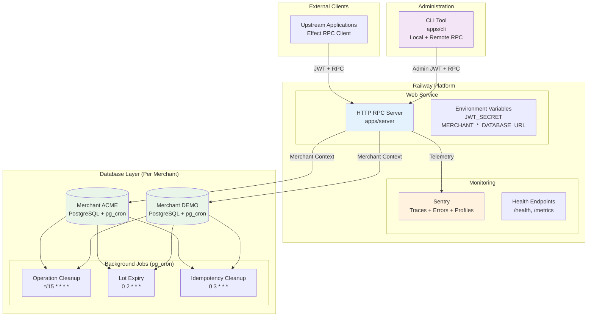

# 6. Implementation Essentials

## Purpose

This document provides implementation-ready specifications for testing, deployment, and operational procedures of the Credit Management Service. It covers Test-Driven Development workflows, Railway deployment configuration, background job implementation, CLI administration patterns, and essential operational procedures.

## 6.1 Testing & TDD

### Test Infrastructure Setup

The system uses Effect's built-in testing framework with multi-tenant test isolation and deterministic test scenarios.

#### Effect.Service Testing Configuration
```typescript
// test/utils/effect-helpers.ts
import { Effect, TestServices, Layer } from "effect"

// Test runtime with mock services
export const TestRuntime = Effect.runtime<TestServices.TestServices>().pipe(
  Runtime.runSync
)

// Mock service layers for unit testing
export const MockServiceLayers = Layer.mergeAll(
  ProductRepository.Mock,
  LedgerRepository.Mock,
  OperationRepository.Mock
)

// Integration test layers with real database
export const IntegrationLayers = Layer.mergeAll(
  DatabaseManager.Live,
  ProductRepository.Default,
  LedgerRepository.Default
)
```

#### Test Database Setup
```typescript
// test/fixtures/database-setup.ts
export class TestDatabaseSetup extends Effect.Service<TestDatabaseSetup>()("TestDatabaseSetup", {
  effect: Effect.gen(function* () {
    return {
      setupTestDatabase: () => Effect.gen(function* () {
        // Create isolated test database
        // Run migrations and seed test data
      }),
      
      cleanupAfterTest: () => Effect.gen(function* () {
        // Truncate tables but preserve schema
        // Reset sequences and constraints
      }),
      
      createTestMerchant: (merchantId: string) => Effect.gen(function* () {
        // Set up multi-tenant test isolation
        // Create test merchant configuration
      })
    }
  })
}) {}
```

### TDD Approach for Financial Operations

The testing strategy follows strict Test-Driven Development with red-green-refactor cycles for all financial operations.

#### Purchase Settlement TDD Example
```typescript
// test/services/business/LedgerService.test.ts
import { Effect, TestClock } from "effect"
import { describe, it, expect } from "vitest"

describe("LedgerService Purchase Settlement", () => {
  it("creates exactly one credit lot per settlement", () =>
    Effect.gen(function* () {
      // ARRANGE - Use mock services for unit testing
      const userId = "user-123"
      const product = TestData.products.basicPlan
      const settlement = TestData.settlements.validSettlement
      
      // ACT - Execute with mock dependencies
      const ledgerService = yield* LedgerService
      const result = yield* ledgerService.processLotCreation(userId, product)
      
      // ASSERT - Verify business logic without database
      expect(result.credits).toBe(product.credits)
      expect(result.userId).toBe(userId)
      expect(result.productCode).toBe(product.code)
    }).pipe(
      Effect.provide(MockServiceLayers),
      Effect.runPromise
    )
  )

  it("handles database errors gracefully", () =>
    Effect.gen(function* () {
      // Test error handling with integration layer
      const result = yield* Effect.either(
        LedgerService.pipe(
          Effect.flatMap(service => service.processLotCreation("invalid-user", invalidProduct))
        )
      )
      
      expect(result._tag).toBe("Left")
      expect(result.left).toBeInstanceOf(DomainError)
    }).pipe(
      Effect.provide(IntegrationLayers),
      Effect.runPromise
    )
  )

  it("repository integration test with real database", () =>
    Effect.gen(function* () {
      // ARRANGE - Set up test database
      yield* TestDatabaseSetup.pipe(Effect.flatMap(setup => setup.setupTestDatabase()))
      
      // ACT - Use real repository with database
      const repo = yield* LedgerRepository
      const result = yield* repo.createCreditLot(userId, product, operationContext)
      
      // ASSERT - Verify database state
      const balance = yield* repo.getUserBalance(userId)
      expect(balance).toBe(product.credits)
      
      const history = yield* repo.getLedgerHistory(userId)
      expect(history).toHaveLength(1)
      expect(history[0].reason).toBe("purchase")
    }).pipe(
      Effect.provide(IntegrationLayers),
      Effect.runPromise
    )
  )
})
```

#### Operation Lifecycle TDD Example
```typescript
describe("Operation Lifecycle", () => {
  it("implements two-phase protocol with rate stability", () =>
    Effect.gen(function* (_) {
      const merchantId = "test-acme"
      const userId = "user-123"
      
      yield* _(TestDatabase.setupTestMerchant(merchantId))
      
      // Setup: Create credit lot and operation type
      const lot = yield* _(createTestLot(userId, 100))
      const operationType = TestData.operationTypes.apiCall
      
      // Phase 1: Operation.Open captures current rate
      const openResult = yield* _(
        OperationService.openOperation({
          userId,
          operationTypeCode: operationType.code
        })
      )
      
      // Rate change after open (shouldn't affect this operation)
      yield* _(updateOperationTypeRate(operationType.code, 2.0))
      
      // Phase 2: Operation.RecordAndClose uses captured rate
      const closeResult = yield* _(
        OperationService.recordAndCloseOperation({
          operationId: openResult.operationId,
          resourceAmount: 10,
          resourceUnit: "requests"
        })
      )
      
      // Verify original rate used (not updated rate)
      const debitEntry = closeResult.ledgerEntry
      expect(debitEntry.amount).toBe(-Math.ceil(10 * operationType.creditsPerUnit))
      expect(debitEntry.lotId).toBe(lot.lotId)
    }).provide(TestLayers)
  )
})
```

### Critical Test Coverage Areas

#### Idempotency Test Patterns
```typescript
describe("Idempotency System", () => {
  it("implements 4-state lifecycle management", () =>
    Effect.gen(function* (_) {
      const idempotencyKey = "test-key-123"
      const merchantId = "test-acme"
      
      // PENDING state prevents duplicate work
      const pendingResult = yield* _(
        IdempotencyService.checkOrCreate(idempotencyKey, "PENDING")
      )
      expect(pendingResult.status).toBe("PENDING")
      
      // Duplicate request returns in_progress response
      const duplicateResult = yield* _(
        IdempotencyService.checkOrCreate(idempotencyKey, "PENDING")
      )
      expect(duplicateResult.status).toBe("in_progress")
      expect(duplicateResult.retryAfter).toBe("5s")
      
      // Complete operation and set SUCCEEDED
      yield* _(
        IdempotencyService.setResult(idempotencyKey, "SUCCEEDED", { data: "result" })
      )
      
      // Subsequent requests return stored result
      const finalResult = yield* _(
        IdempotencyService.checkOrCreate(idempotencyKey, "PENDING")
      )
      expect(finalResult.status).toBe("completed")
      expect(finalResult.result.data).toBe("result")
    }).provide(TestLayers)
  )
  
  it("generates deterministic transaction IDs", () => {
    const merchantId = "acme-corp"
    const commandType = "PurchaseSettled"
    const idempotencyKey = "client-key-123"
    
    const txId1 = IdempotencyService.generateTransactionId(
      merchantId, commandType, idempotencyKey
    )
    const txId2 = IdempotencyService.generateTransactionId(
      merchantId, commandType, idempotencyKey
    )
    
    expect(txId1).toBe(txId2) // Deterministic
    expect(UUID.validate(txId1)).toBe(true) // Valid UUID
  })
})
```

### Integration Tests

#### RPC Client/Server Integration
```typescript
describe("RPC Integration", () => {
  it("handles authentication and merchant routing", () =>
    Effect.gen(function* (_) {
      const merchantId = "test-acme"
      const jwt = yield* _(createTestJWT({ sub: merchantId }))
      
      // Create RPC client with JWT
      const client = yield* _(
        RpcClient.make({
          baseUrl: "http://localhost:3000",
          headers: { Authorization: `Bearer ${jwt}` }
        })
      )
      
      // Execute authenticated request
      const result = yield* _(
        client(new GetUserBalance({ userId: "user-123" }))
      )
      
      expect(result.balance).toBe(0)
      expect(result.currency).toBe("credits")
    }).provide(TestLayers.pipe(
      Layer.provide(TestHttpServer.layer) // Test server running
    ))
  )
})
```

#### Background Job Integration
```typescript
describe("Background Jobs", () => {
  it("processes lot expiry correctly", () =>
    Effect.gen(function* (_) {
      const merchantId = "test-acme"
      const userId = "user-123"
      
      yield* _(TestDatabase.setupTestMerchant(merchantId))
      
      // Create expired lot
      const expiredLot = yield* _(
        createTestLot(userId, 100, { expiresAt: TestClock.currentTimeMillis - 1000 })
      )
      
      // Run expiry job
      yield* _(ExpiryProcessor.processExpiredLots())
      
      // Verify expiry debit created
      const entries = yield* _(LedgerRepository.getUserLedgerHistory(userId))
      const expiryEntry = entries.find(e => e.reason === "expiry")
      
      expect(expiryEntry).toBeDefined()
      expect(expiryEntry.amount).toBe(-100)
      expect(expiryEntry.lotId).toBe(expiredLot.lotId)
    }).provide(TestLayers.pipe(
      Layer.provide(TestClock.layer)
    ))
  )
})
```

### Multi-Tenant Testing Strategy

#### Tenant Isolation Testing
```typescript
describe("Multi-Tenant Isolation", () => {
  it("prevents cross-tenant data access", () =>
    Effect.gen(function* (_) {
      const acmeId = "test-acme"
      const demoId = "test-demo"
      
      // Setup two isolated merchant databases
      yield* _(TestDatabase.setupTestMerchant(acmeId))
      yield* _(TestDatabase.setupTestMerchant(demoId))
      
      // Create data in acme tenant
      const acmeLot = yield* _(
        LedgerService.createCreditLot(acmeId, "user-123", TestData.products.basic)
      )
      
      // Query from demo tenant should not see acme data
      const demoResult = yield* _(
        LedgerService.getUserBalance(demoId, "user-123")
      )
      
      expect(demoResult.balance).toBe(0)
      expect(demoResult.lots).toHaveLength(0)
      
      // Verify acme data exists in acme tenant
      const acmeResult = yield* _(
        LedgerService.getUserBalance(acmeId, "user-123")
      )
      
      expect(acmeResult.balance).toBe(TestData.products.basic.credits)
    }).provide(TestLayers)
  )
})
```

## 6.2 Deployment & Operations

### Railway Setup Configuration

The deployment strategy uses Railway's native capabilities with platform-optimized configuration.

#### Service Architecture
```typescript
// Project structure for Railway deployment
// 
// Railway Project: credit-system
//   ├── Service: web-server (apps/server HTTP API)
//   ├── Service: background-jobs (pg_cron in each merchant DB)
//   └── Environment: shared variables across services

// Web service configuration
export const RailwayWebConfig = {
  buildCommand: "npm run build",
  startCommand: "npm run start:server",
  watchPaths: [
    "apps/server/**",
    "packages/rpc/**", 
    "packages/client/**",
    "packages/shared/**"
  ],
  healthcheckPath: "/health",
  port: process.env.PORT || 3000
}
```

#### Environment Variable Management
```typescript
// packages/shared/src/config/Config.ts
import { Config } from "effect"

export const ServiceConfig = Config.all({
  // Core service configuration
  jwtSecret: Config.secret("JWT_SECRET"),
  nodeEnv: Config.string("NODE_ENV").pipe(Config.withDefault("development")),
  serviceName: Config.string("SERVICE_NAME").pipe(Config.withDefault("credit-system")),
  
  // Monitoring and observability
  sentryDsn: Config.string("SENTRY_DSN"),
  railwayCommitSha: Config.option(Config.string("RAILWAY_GIT_COMMIT_SHA")),
  
  // Multi-tenant database URLs
  merchantDatabases: Config.all({
    acme: Config.string("MERCHANT_ACME_DATABASE_URL"),
    demo: Config.string("MERCHANT_DEMO_DATABASE_URL")
    // Add more merchants as needed
  })
})

// Dynamic merchant resolution
export const getMerchantDatabaseUrl = (merchantId: string): Effect.Effect<string, ConfigError> =>
  Config.string(`MERCHANT_${merchantId.toUpperCase()}_DATABASE_URL`)
```

#### Deployment Scripts
```json
// package.json - Root workspace
{
  "scripts": {
    "build": "npm run build --workspaces --if-present",
    "start:server": "npm run start --workspace=apps/server",
    "migrate:all": "npm run migrate --workspace=apps/cli -- --all-merchants",
    "health:check": "npm run health --workspace=apps/server"
  }
}

// apps/server/package.json
{
  "scripts": {
    "build": "tsc",
    "start": "node dist/main.js",
    "migrate": "node dist/migrations/runner.js",
    "health": "node dist/health/check.js"
  }
}
```

### Background Jobs Implementation

Background jobs run as PostgreSQL pg_cron scheduled procedures in each merchant database, following the pattern established in the research.

#### pg_cron Job Implementation
```sql
-- Migration: 020_setup_background_jobs.sql
-- Applied per merchant database

-- Enable pg_cron extension
CREATE EXTENSION IF NOT EXISTS pg_cron;

-- Create job logging table
CREATE TABLE IF NOT EXISTS app.job_runs (
  id BIGSERIAL PRIMARY KEY,
  job_name TEXT NOT NULL,
  started_at TIMESTAMPTZ NOT NULL DEFAULT NOW(),
  finished_at TIMESTAMPTZ,
  affected_rows INTEGER,
  error_message TEXT
);

-- Schedule background jobs
-- Operation cleanup: every 15 minutes
SELECT cron.schedule(
  'operation_cleanup', 
  '*/15 * * * *', 
  'CALL app.cleanup_expired_operations();'
);

-- Lot expiry: daily at 2 AM
SELECT cron.schedule(
  'lot_expiry', 
  '0 2 * * *', 
  'CALL app.expire_lots();'
);

-- Idempotency cleanup: daily at 3 AM  
SELECT cron.schedule(
  'idempotency_cleanup', 
  '0 3 * * *', 
  'CALL app.cleanup_idempotency();'
);
```

#### Job Procedure Implementation
```sql
-- Migration: 021_job_procedures.sql

-- Expire lots with positive balance past expiry date
CREATE OR REPLACE FUNCTION app.expire_lots() RETURNS VOID LANGUAGE plpgsql AS $$
DECLARE
  locked BOOLEAN;
  v_count INTEGER := 0;
  v_batch_size INTEGER := 100;
  lot_record RECORD;
BEGIN
  -- Advisory lock prevents concurrent execution
  SELECT pg_try_advisory_lock(hashtext('app.expire_lots')) INTO locked;
  IF NOT locked THEN RETURN; END IF;
  
  BEGIN
    -- Find expired lots with positive balance
    FOR lot_record IN
      SELECT 
        le.entry_id as lot_id,
        le.user_id,
        le.product_code,
        le.expires_at,
        COALESCE(lot_balance.balance, 0) as remaining_balance
      FROM ledger_entries le
      LEFT JOIN (
        SELECT 
          lot_id, 
          SUM(amount) as balance 
        FROM ledger_entries 
        GROUP BY lot_id
      ) lot_balance ON le.entry_id = lot_balance.lot_id
      WHERE le.amount > 0  -- Initial credit entries (lots)
        AND le.expires_at < NOW()
        AND COALESCE(lot_balance.balance, 0) > 0
      LIMIT v_batch_size
    LOOP
      -- Create expiry debit entry
      INSERT INTO ledger_entries (
        user_id,
        lot_id, 
        amount,
        reason,
        operation_type,
        resource_amount,
        resource_unit,
        workflow_id,
        created_at
      ) VALUES (
        lot_record.user_id,
        lot_record.lot_id,
        -lot_record.remaining_balance,
        'expiry',
        'lot_expiry',
        lot_record.remaining_balance,
        'CREDIT',
        'system-expiry-' || EXTRACT(EPOCH FROM NOW()),
        NOW()
      );
      
      v_count := v_count + 1;
    END LOOP;
    
  EXCEPTION WHEN OTHERS THEN
    INSERT INTO app.job_runs(job_name, error_message) 
    VALUES ('lot_expiry', SQLERRM);
    PERFORM pg_advisory_unlock(hashtext('app.expire_lots'));
    RAISE;
  END;
  
  -- Log successful completion
  INSERT INTO app.job_runs(job_name, finished_at, affected_rows)
  VALUES ('lot_expiry', NOW(), v_count);
  
  PERFORM pg_advisory_unlock(hashtext('app.expire_lots'));
END;$$;

-- Cleanup expired operations  
CREATE OR REPLACE FUNCTION app.cleanup_expired_operations() RETURNS VOID LANGUAGE plpgsql AS $$
DECLARE
  locked BOOLEAN;
  v_count INTEGER := 0;
BEGIN
  SELECT pg_try_advisory_lock(hashtext('app.cleanup_expired_operations')) INTO locked;
  IF NOT locked THEN RETURN; END IF;
  
  BEGIN
    -- Mark expired open operations
    UPDATE operations 
    SET 
      status = 'expired',
      updated_at = NOW()
    WHERE status = 'open' 
      AND expires_at < NOW();
      
    GET DIAGNOSTICS v_count = ROW_COUNT;
    
  EXCEPTION WHEN OTHERS THEN
    INSERT INTO app.job_runs(job_name, error_message)
    VALUES ('operation_cleanup', SQLERRM);
    PERFORM pg_advisory_unlock(hashtext('app.cleanup_expired_operations'));
    RAISE;
  END;
  
  INSERT INTO app.job_runs(job_name, finished_at, affected_rows)
  VALUES ('operation_cleanup', NOW(), v_count);
  
  PERFORM pg_advisory_unlock(hashtext('app.cleanup_expired_operations'));
END;$$;

-- Cleanup old idempotency records (7-day retention)
CREATE OR REPLACE FUNCTION app.cleanup_idempotency() RETURNS VOID LANGUAGE plpgsql AS $$
DECLARE
  locked BOOLEAN;
  v_count INTEGER := 0;
  v_retention INTERVAL := INTERVAL '7 days';
BEGIN
  SELECT pg_try_advisory_lock(hashtext('app.cleanup_idempotency')) INTO locked;
  IF NOT locked THEN RETURN; END IF;
  
  BEGIN
    -- Delete old completed/failed idempotency records
    DELETE FROM idempotency_tracking 
    WHERE created_at < (NOW() - v_retention)
      AND status IN ('SUCCEEDED', 'FAILED_FINAL');
      
    GET DIAGNOSTICS v_count = ROW_COUNT;
    
  EXCEPTION WHEN OTHERS THEN
    INSERT INTO app.job_runs(job_name, error_message)
    VALUES ('idempotency_cleanup', SQLERRM);
    PERFORM pg_advisory_unlock(hashtext('app.cleanup_idempotency'));
    RAISE;
  END;
  
  INSERT INTO app.job_runs(job_name, finished_at, affected_rows)
  VALUES ('idempotency_cleanup', NOW(), v_count);
  
  PERFORM pg_advisory_unlock(hashtext('app.cleanup_idempotency'));
END;$$;
```

### CLI Administration Tool

The CLI provides comprehensive administrative capabilities following the service API pattern established in the brief.

#### CLI Architecture
```typescript
// apps/cli/src/main.ts
import { Command } from "@effect/cli"
import { Effect, Config } from "effect"

// CLI configuration using same service config
const CliConfig = Config.all({
  creditServiceUrl: Config.string("CREDIT_SERVICE_URL")
    .pipe(Config.withDefault("http://localhost:3000")),
  adminJwt: Config.secret("CREDIT_SERVICE_JWT"),
  defaultMerchant: Config.option(Config.string("DEFAULT_MERCHANT_ID"))
})

// Command structure: verb-noun pattern
const creditCli = Command.make("credit-cli", {
  grant: Command.make("grant", {
    apply: GrantCommands.applyCommand
  }),
  product: Command.make("product", {
    create: ProductCommands.createCommand,
    list: ProductCommands.listCommand,
    archive: ProductCommands.archiveCommand
  }),
  adjustment: Command.make("adjustment", {
    apply: AdjustmentCommands.applyCommand
  }),
  merchant: Command.make("merchant", {
    onboard: MerchantCommands.onboardCommand,
    status: MerchantCommands.statusCommand
  }),
  migrate: Command.make("migrate", {
    run: MigrationCommands.runCommand,
    status: MigrationCommands.statusCommand
  })
})

// CLI execution with Effect runtime
const main = creditCli.pipe(
  Command.run({
    name: "Credit Management CLI",
    version: "1.0.0"
  }),
  Effect.provide(CliConfig),
  Effect.runPromise
)

if (import.meta.main) {
  main()
}
```

#### Command Implementation Patterns
```typescript
// apps/cli/src/commands/GrantCommands.ts
export const GrantCommands = {
  applyCommand: Command.make("apply", {
    options: {
      merchant: Options.text("merchant").pipe(Options.withAlias("m")),
      user: Options.text("user").pipe(Options.withAlias("u")),  
      credits: Options.integer("credits").pipe(Options.withAlias("c")),
      reason: Options.text("reason").pipe(
        Options.withDefault("manual_grant"),
        Options.withDescription("Grant justification for audit trail")
      ),
      period: Options.integer("period").pipe(
        Options.withAlias("p"),
        Options.withDefault(365),
        Options.withDescription("Access period in days")
      )
    }
  }, ({ merchant, user, credits, reason, period }) => 
    Effect.gen(function* (_) {
      const config = yield* _(CliConfig)
      const client = yield* _(RpcClient.make({
        baseUrl: config.creditServiceUrl,
        headers: { Authorization: `Bearer ${config.adminJwt}` }
      }))
      
      Console.log(`Applying ${credits} credit grant for ${user}@${merchant}...`)
      
      const result = yield* _(
        client(new CreditAdjustment.Apply({
          merchantId: merchant,
          userId: user,
          creditAmount: credits,
          accessPeriodDays: period,
          justification: reason,
          adminActor: "cli-admin"
        }))
      )
      
      Console.log(`✓ Grant applied successfully`)
      Console.log(`  Lot ID: ${result.lot.lotId}`)
      Console.log(`  Credits: ${result.lot.creditsTotal}`) 
      Console.log(`  Expires: ${result.lot.expiresAt}`)
    }).pipe(
      Effect.catchAll(error => 
        Console.error(`✗ Grant failed: ${error.message}`).pipe(
          Effect.zipRight(Effect.fail(new CliError("Grant application failed")))
        )
      )
    )
  )
}

// apps/cli/src/commands/ProductCommands.ts  
export const ProductCommands = {
  createCommand: Command.make("create", {
    options: {
      merchant: Options.text("merchant").pipe(Options.withAlias("m")),
      code: Options.text("code"),
      title: Options.text("title"),
      credits: Options.integer("credits"),
      price: Options.number("price").pipe(Options.optional),
      currency: Options.text("currency").pipe(Options.withDefault("USD")),
      country: Options.text("country").pipe(Options.withDefault("*")),
      period: Options.integer("period").pipe(Options.withDefault(365))
    }
  }, (options) =>
    Effect.gen(function* (_) {
      const config = yield* _(CliConfig)
      const client = yield* _(createRpcClient(config))
      
      Console.log(`Creating product ${options.code} for ${options.merchant}...`)
      
      const product = {
        productCode: options.code,
        title: options.title,
        credits: options.credits,
        accessPeriodDays: options.period,
        distribution: options.price ? "sellable" : "grant",
        priceRows: options.price ? [{
          country: options.country,
          currency: options.currency,
          amount: options.price
        }] : []
      }
      
      const result = yield* _(
        client(new Product.Create({
          merchantId: options.merchant,
          product
        }))
      )
      
      Console.log(`✓ Product created successfully`)
      Console.log(`  Code: ${result.product.productCode}`)
      Console.log(`  Distribution: ${result.product.distribution}`)
    })
  )
}
```

### Operational Procedures

#### Merchant Onboarding Process
```typescript
// apps/cli/src/procedures/MerchantOnboarding.ts
export const MerchantOnboarding = {
  onboardNewMerchant: (merchantConfig: MerchantConfig) => Effect.gen(function* (_) {
    Console.log(`Starting onboarding for merchant: ${merchantConfig.merchantId}`)
    
    // 1. Validate configuration
    yield* _(validateMerchantConfig(merchantConfig))
    Console.log("✓ Configuration validated")
    
    // 2. Create database and apply migrations
    yield* _(createMerchantDatabase(merchantConfig))
    Console.log("✓ Database created and migrated")
    
    // 3. Generate JWT token
    const jwt = yield* _(generateMerchantJWT(merchantConfig.merchantId))
    Console.log("✓ JWT token generated")
    
    // 4. Create default products if specified
    if (merchantConfig.defaultProducts) {
      yield* _(createDefaultProducts(merchantConfig))
      Console.log("✓ Default products created")
    }
    
    // 5. Setup monitoring and alerting
    yield* _(configureMerchantMonitoring(merchantConfig))
    Console.log("✓ Monitoring configured")
    
    Console.log(`🎉 Merchant ${merchantConfig.merchantId} onboarded successfully`)
    Console.log(`   JWT Token: ${jwt}`)
    Console.log(`   Database: ${merchantConfig.databaseUrl}`)
  })
}

// Merchant validation
const validateMerchantConfig = (config: MerchantConfig) => Effect.gen(function* (_) {
  // Validate required fields
  if (!config.merchantId || !config.legalName) {
    yield* _(Effect.fail(new ValidationError("Missing required merchant fields")))
  }
  
  // Check database connectivity
  yield* _(testDatabaseConnection(config.databaseUrl))
  
  // Validate JWT signing capability
  yield* _(testJWTGeneration(config.merchantId))
})
```

#### Incident Response Procedures  
```typescript
// apps/cli/src/procedures/IncidentResponse.ts
export const IncidentResponse = {
  // Emergency: Maintenance mode for a merchant (block new debits/opens)
  emergencyPause: (merchantId: string, reason: string) => Effect.gen(function* (_) {
    Console.log(`🚨 EMERGENCY PAUSE for merchant ${merchantId}: ${reason}`)
    
    // 1. Enable maintenance mode flag (service-level). New Operation.Open/RecordAndClose requests are rejected.
    yield* _(enableMaintenanceMode(merchantId))
    Console.log("✓ Maintenance mode enabled (new operations blocked)")
    
    // 2. Log emergency action
    yield* _(logEmergencyAction(merchantId, "PAUSE", reason))
    
    // 3. Notify monitoring systems
    yield* _(sendEmergencyAlert(merchantId, "OPERATIONS_PAUSED"))
    
    Console.log("✓ Emergency pause complete - manual recovery required")
  }),
  
  // Recovery: Resume operations after incident resolution
  resumeOperations: (merchantId: string) => Effect.gen(function* (_) {
    Console.log(`Resuming operations for merchant ${merchantId}`)
    
    // 1. Check system health
    yield* _(validateSystemHealth(merchantId))
    Console.log("✓ System health validated")
    
    // 2. Disable maintenance mode flag (allow new operations)
    yield* _(disableMaintenanceMode(merchantId))
    Console.log("✓ Maintenance mode disabled (operations allowed)")
    
    // 3. Log recovery action
    yield* _(logEmergencyAction(merchantId, "RESUME", "Manual recovery"))
    
    Console.log("✓ Operations resumed successfully")
  })
}

#### Service Availability (Readiness + Write Guard)

Context
- Architecture uses a separate Postgres database per merchant. Availability state is therefore scoped per database; no `merchant_id` column is required.

Pattern
- Store a single service status row in each merchant database and use it to signal maintenance mode. Middleware enforces write blocking when status = `maintenance`.

Schema (per-merchant database)
```sql
CREATE TABLE IF NOT EXISTS service_status (
  id           boolean PRIMARY KEY DEFAULT TRUE, -- enforce single row (id=true)
  status       text NOT NULL CHECK (status IN ('ready','maintenance')),
  reason       text,
  until        timestamptz,
  updated_at   timestamptz NOT NULL DEFAULT now()
);

-- Initialize as ready (idempotent upsert)
INSERT INTO service_status (id, status)
VALUES (TRUE, 'ready')
ON CONFLICT (id) DO NOTHING;
```

Enforcement
- Middleware flow: resolve merchant database from JWT → read `service_status` (cached briefly) →
  - If `status='maintenance'` and RPC is a write (Purchase.Settled, Operation.Open, Operation.RecordAndClose, Grant.Apply, CreditAdjustment.Apply, Refund.Apply, Chargeback.Apply): return a typed `ServiceUnavailable`/`MaintenanceMode` error (optionally include `Retry-After` derived from `until`).
  - Allow read RPCs (balances, history, receipts) to proceed.
- Health endpoints:
  - Liveness: always OK (keeps process stable).
  - Readiness: reflect `maintenance` for the targeted merchant DB (or aggregate if your service instance serves multiple merchants), including `reason`/`until` for operators.

Operations
- Enter maintenance: `UPDATE service_status SET status='maintenance', reason=$1, until=$2, updated_at=now() WHERE id=TRUE`.
- Exit maintenance: `UPDATE service_status SET status='ready', reason=NULL, until=NULL, updated_at=now() WHERE id=TRUE`.
```

#### Health Check and Monitoring
```typescript
// apps/server/src/health/HealthService.ts
export const HealthService = Effect.gen(function* (_) {
  const config = yield* _(ServiceConfig)
  
  return {
    // Comprehensive health check endpoint
    checkHealth: () => Effect.gen(function* (_) {
      const startTime = Date.now()
      
      // Check database connectivity for all merchants
      const merchantHealth = yield* _(
        Effect.all(
          Object.entries(config.merchantDatabases).map(([merchantId, dbUrl]) =>
            checkMerchantDatabase(merchantId, dbUrl).pipe(
              Effect.either,
              Effect.map(result => ({ merchantId, healthy: Either.isRight(result) }))
            )
          )
        )
      )
      
      // Check background job status
      const jobHealth = yield* _(checkBackgroundJobs())
      
      // Check external service dependencies
      const externalHealth = yield* _(checkExternalServices())
      
      const responseTime = Date.now() - startTime
      const allHealthy = merchantHealth.every(m => m.healthy) && 
                        jobHealth.healthy && 
                        externalHealth.healthy
      
      return {
        status: allHealthy ? "healthy" : "degraded",
        timestamp: new Date().toISOString(),
        responseTimeMs: responseTime,
        merchants: merchantHealth,
        backgroundJobs: jobHealth,
        externalServices: externalHealth
      }
    })
  }
})

// Background job monitoring
const checkBackgroundJobs = () => Effect.gen(function* (_) {
  const config = yield* _(ServiceConfig)
  
  // Check recent job execution across all merchant databases
  const jobResults = yield* _(
    Effect.all(
      Object.entries(config.merchantDatabases).map(([merchantId, dbUrl]) =>
        Effect.tryPromise(() => 
          queryJobRuns(dbUrl, "SELECT job_name, MAX(finished_at) as last_run FROM app.job_runs GROUP BY job_name")
        ).pipe(
          Effect.map(rows => ({ merchantId, jobs: rows }))
        )
      )
    )
  )
  
  // Validate that critical jobs ran recently
  const now = new Date()
  const criticalJobs = ["operation_cleanup", "lot_expiry", "idempotency_cleanup"]
  
  const issues = jobResults.flatMap(({ merchantId, jobs }) => 
    criticalJobs.filter(jobName => {
      const lastRun = jobs.find(j => j.job_name === jobName)?.last_run
      if (!lastRun) return true // Never ran
      const timeSinceRun = now.getTime() - new Date(lastRun).getTime()
      return timeSinceRun > 24 * 60 * 60 * 1000 // More than 24 hours
    }).map(jobName => `${merchantId}:${jobName}`)
  )
  
  return {
    healthy: issues.length === 0,
    issues,
    lastChecked: now.toISOString()
  }
})
```

## Essential Figures

### Figure 6.1: Deployment Overview



**Deployment Architecture Principles:**
- **Platform-Native**: Railway handles all infrastructure concerns (scaling, monitoring, networking)
- **Multi-Tenant Isolation**: Complete database separation per merchant
- **Background Jobs**: pg_cron procedures run inside each merchant database
- **Zero DevOps**: No custom infrastructure management required
- **Admin Access**: CLI tool uses same RPC API as client applications

### Figure 6.2: Background Job Flow

```mermaid
flowchart TD
    subgraph "Job Scheduling (pg_cron)"
        CRON1[Operation Cleanup<br/>Every 15 minutes]
        CRON2[Lot Expiry<br/>Daily 2 AM]
        CRON3[Idempotency Cleanup<br/>Daily 3 AM]
    end
    
    subgraph "Job Execution Pattern"
        LOCK{Advisory Lock<br/>Acquired?}
        BATCH[Process Batch<br/>(100-500 records)]
        LOG[Log Results<br/>app.job_runs]
        UNLOCK[Release Lock]
        ERROR[Log Error<br/>Continue Next Run]
    end
    
    subgraph "Job Types"
        subgraph "Cleanup Operations"
            EXPIRE_OPS[Mark Operations<br/>status='expired'<br/>WHERE expires_at < NOW()]
        end
        
        subgraph "Lot Expiry"
            FIND_LOTS[Find Expired Lots<br/>expires_at < NOW()<br/>AND balance > 0]
            CREATE_DEBIT[Create Expiry Debit<br/>amount = -remaining_balance<br/>reason = 'expiry']
        end
        
        subgraph "Idempotency Maintenance"
            CLEANUP_OLD[DELETE FROM<br/>idempotency_tracking<br/>WHERE age > 7 days<br/>AND status IN ('SUCCEEDED', 'FAILED_FINAL')]
        end
    end
    
    CRON1 --> LOCK
    CRON2 --> LOCK  
    CRON3 --> LOCK
    
    LOCK -->|Yes| BATCH
    LOCK -->|No| END[Skip Run]
    
    BATCH --> EXPIRE_OPS
    BATCH --> FIND_LOTS
    BATCH --> CLEANUP_OLD
    
    EXPIRE_OPS --> LOG
    FIND_LOTS --> CREATE_DEBIT
    CREATE_DEBIT --> LOG
    CLEANUP_OLD --> LOG
    
    LOG --> UNLOCK
    BATCH -->|Exception| ERROR
    ERROR --> UNLOCK
    
    style LOCK fill:#fff3e0
    style BATCH fill:#e3f2fd
    style LOG fill:#c8e6c9
    style ERROR fill:#ffcdd2
```

**Background Job Design Principles:**
- **Concurrency Safety**: Advisory locks prevent overlapping job execution
- **Batch Processing**: Small batches maintain database performance
- **Error Isolation**: Job failures don't affect other merchants or operations
- **Audit Trail**: All job runs logged with timing and affected row counts  
- **Idempotent Operations**: Safe to retry and re-run without side effects
- **Per-Merchant Execution**: Each merchant database runs jobs independently

## Implementation Notes

### TDD Development Workflow
- **Red-Green-Refactor**: Write failing tests first, implement minimal code to pass, refactor for quality
- **Test Categories**: Prioritize financial operations > idempotency > infrastructure
- **Effect Testing**: Leverage Effect's built-in testability for deterministic error scenarios
- **Multi-Tenant Tests**: Verify complete isolation between merchant databases

### Deployment Best Practices  
- **Environment Variables**: Use Railway's native variable management for all configuration
- **Health Monitoring**: Implement comprehensive health checks covering databases and background jobs
- **Zero-Downtime**: Railway handles rolling deployments and service scaling automatically
- **CLI Administration**: Use RPC-based CLI for all administrative operations (no direct database access)

### Operational Excellence
- **Monitoring First**: Set up health checks and error tracking before going live
- **Incident Response**: Document emergency procedures for operations pause/resume
- **Merchant Onboarding**: Automated procedures for new merchant database setup and configuration
- **Background Job Monitoring**: Track job execution frequency and success rates across all merchants

This implementation guide provides the concrete foundation for building, testing, deploying, and operating the Credit Management Service using the platform-native approach established in the technical brief.
